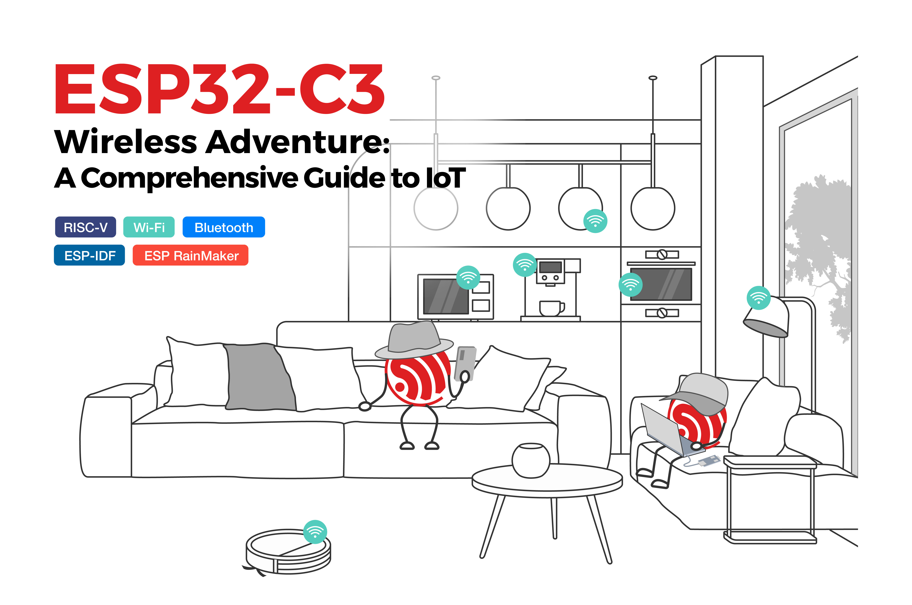

# ESP32-C3 Wireless Adventure
[]([https://github.com/espressif/esp32-c3-book-en/pulls])
[]([https://espressif.github.io/esp32-c3-book-en/])




**ESP32-C3** is a cost-effective RISC-V MCU with Wi-Fi and Bluetooth 5 (LE) connectivity for secure IoT applications. To show the various applications of this powerful chipset, this book will take you on an interesting journey through AIoT, starting from the basics of IoT project development and environment setup to practical examples.

## 📣 Support
- Read the [book](https://espressif.github.io/esp32-c3-book-en/).
- The [pdf version](https://www.espressif.com/sites/default/files/documentation/ESP32-C3%20Wireless%20Adventure.pdf).
- Download the source code [GitHub repository](https://github.com/espressif/book-esp32c3-iot-projects).
- Share your thoughts and questions on Espressif’s [official forum](https://www.esp32.com/bookc3).

## 🏃 Quickstart

This book is generated using [mdbook](https://github.com/rust-lang/mdBook), a utility to create modern online books from **Markdown** files.

Check out the [User Guide](https://rust-lang.github.io/mdBook/) for a list of features and installation and usage information.

To install the tool:

```shell
cargo install mdbook
```

Then you can clone the repository and start a development server by running:

```shell
git clone https://github.com/espressif/esp32-c3-book-en
cd ~/esp32-c3-book-en
mdbook serve
```

## 📗Content Breakdown

<table>
  <thead>
    <tr>
      <th>Parts</th>
      <th>Chapters</th>
      <th>Description</th>
       <th>Skills learned</th>
    </tr>
  </thead>

  <tbody>
    <tr>
      <td rowspan="4">Part 1</td>
      <td>Chapter1</td>
      <td rowspan="4">Explain basic IoT architecture, stages of smart home development, ESP RainMaker and ESP-IDF SDK overview</td>
      <td rowspan="4">
      <ul><li>IoT basic concepts</li> <li>Smart homes</li><li>Environment</li><li>Cloud solution</li>
      </td>
      </tr>
      <tr><td>Chapter2</td></tr>
      <tr><td>Chapter3</td></tr>
      <tr><td>Chapter4</td></tr>
    <tr>
      <td rowspan="2">Part2</td>
       <td>Chapter5</td>
      <td rowspan="2">Design the minimum hardware system based on ESP32-C3  and application scenarios, understand the peripheral interfaces and driver development</td>
      <td rowspan="2"><ul><li>Smart light hardware design</li><li>Driver development</li></td>
    </tr>
    <tr><td>Chapter6</td></tr>
     <tr>
      <td rowspan="5">Part3</td>
      <td>Chapter7</td>
      <td rowspan="5">Use Wi-Fi and Bluetooth for network connectivity and local and cloud control</td>
      <td rowspan="5"><ul><li>Wi-Fi</li><li>Bluetooth</li> <li>MQTT</li></td>
     <tr><td>Chapter8</td></tr>
     <tr><td>Chapter9</td></tr>
     <tr><td>Chapter10</td></tr>
     <tr><td>Chapter11</td></tr>
     <tr>
      <td rowspan="4">Part 4</td>
      <td>Chapter12</td>
      <td rowspan="4">How to use power management and low power optimsation and enhance the device security, mass flashing and testing and remote monitoring platform-ESP Insights. </td>
      <td rowspan="4"><ul> <li> Low power modes</li> <li> Security features </li> <li> Firmware burning </li> <li> Remote monitoring</li></td>
      </tr>
      <tr><td>Chapter13</td></tr>
      <tr><td>Chapter14</td></tr>
      <tr><td>Chapter15</td></tr>
    </tr>
  </tbody>
</table>


## 🤝 Contribution

Please check [CONTRIBUTING.md](CONTRIBUTING.md) if you'd like to help improve the book. Contributions in the forms of pull requests, bug reports, and feature requests are all welcome!

## 🤹 Share your adventure

More topics are coming to join our adventure (e.g., Matter, AI, and HMI). Fancy a chapter written by yourself? Check out our [writing guidelines](WRITINGS.md).

## 🙌 Help wanted

Would you like to contribute a **translation**? Please read our [translation guidelines](TRANSLATIONS.md).
