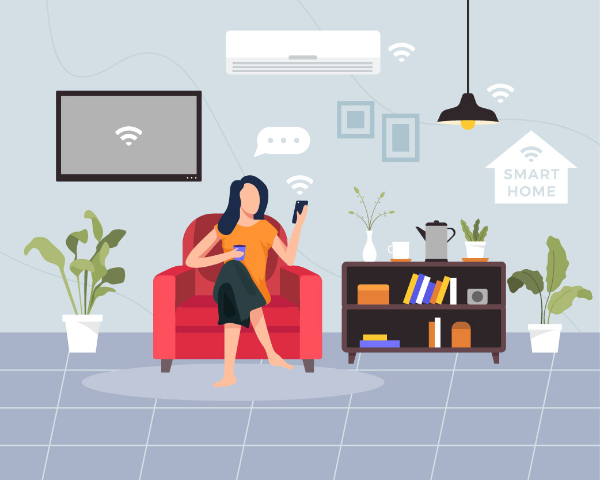
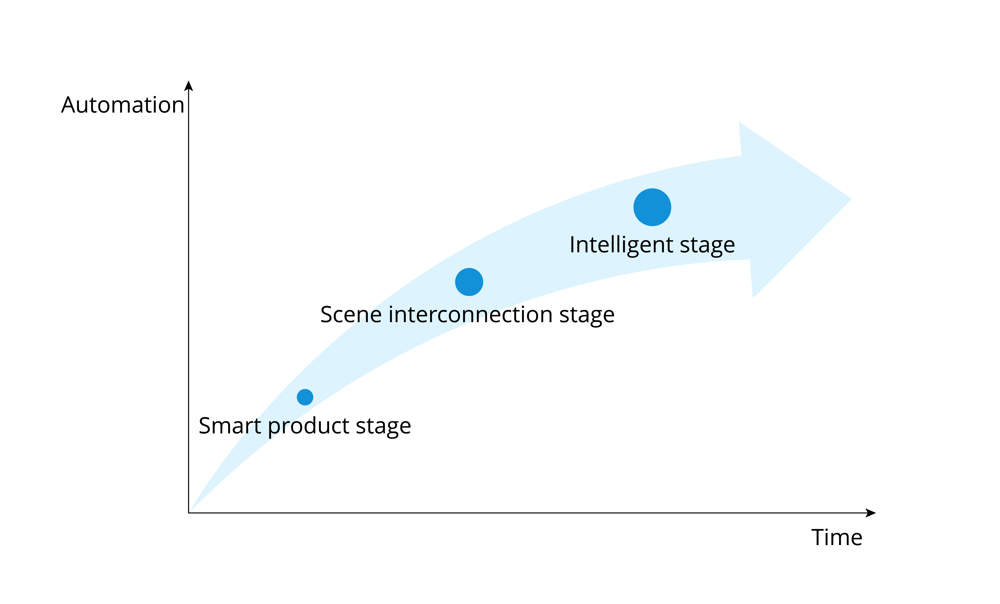

# IoT Application in Smart Homes

IoT has penetrated into all walks of life, and the most closely related IoT application to us is the smart home. Many traditional appliances are now equipped with one or more IoT devices, and many newly built houses are designed with IoT technologies from the start. Figure 1.1 shows some common smart home devices.

<figure align="center">
    
    <figcaption>Figure 1.1. Common smart home devices</figcaption>
</figure>

The development of smart home can be simply divided into smart product stage, scene interconnection stage and intelligent stage, as shown in Figure 1.2.

<figure align="center">
    
    <figcaption>Figure 1.2. Development stage of smart home</figcaption>
</figure>

The first stage is about **smart products**. Different from traditional homes, in smart homes, IoT devices receive signals with sensors, and are networked through wireless communication technologies such as Wi-Fi, Bluetooth LE, and ZigBee. Users can control smart products in a variety of ways, such as smartphone apps, voice assistants, smart speaker control, etc.

The second stage focuses on **scene interconnection**. In this stage, developers are no longer considering controlling single smart product, but interconnecting two or more smart products, automating to a certain extent, and finally forming a custom scene mode. For example, when the user presses any scene mode button, the lights, curtains, and air conditioners will be automatically adapted to the presets. Of course, there is the prerequisite that the linkage logic are readily set up, including trigger conditions and execution actions. Imagine that the air conditioning heating mode is triggered when the indoor temperature drops below 10°C; that at 7 o’clock in the morning, music is played to wake up the user, smart curtains are opened, and the rice cooker or bread toaster starts through a smart socket; as the user gets up and finishes washing, breakfast is already served, so that there will be no delay in going to work. How convenient has our life become!

The third stage goes to **intelligence stage**. As more smart home devices are accessed, so will the types of data generated. With the help of cloud computing, big data and artificial intelligence, it is like a “smarter brain” has been planted into smart homes, which no longer require frequent commands from the user. They collect data from previous interactions and learn the user's behaviour patterns and preferences, so as to automate activities, including providing recommendations for decision-making.

Currently, most smart homes are at the scene interconnection stage. As the penetration rate and intelligence of smart products increase, barriers between communication protocols are being removed. In the future, smart homes are bound to become really “smart”, just like the AI system Jarvis in *Iron Man*, which can not only help the user control various devices, handle daily affairs, but also have super computing power and thinking ability. In the intelligent stage, human beings will receive better services both in quantity and quality.