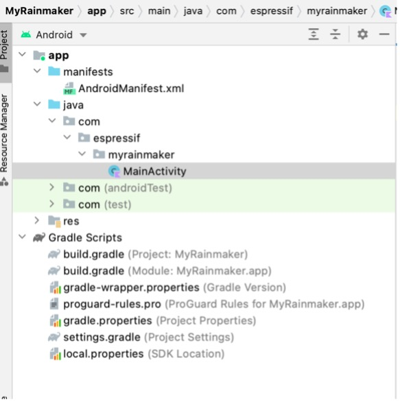

# Structure of the Android Project

This section takes MyRainmaker App as an example to introduce the
structure of an Android project. There are two folders in the root
directory, namely `app` and `Gradle Scripts`. The `app` folder contains all the code and resources to develop the smartphone app, and the `Gradle Scripts` folder contains scripts related to Gradle compilation. The structure of this Android project is shown in Figure 10.1.

<figure align="center">
    
    <figcaption>Figure 10.1. Structure of the Android project</figcaption>
</figure>

## `App` folder

The `app` folder contains three subfolders: `manifests`, `java`, and `res`.

-   `manifests`: Stores app configurations, including name, version,
    SDK, and permissions.

-   `java`: Mainly stores source code and test code.

-   `res`: Stores all project resources.

## `Gradle Scripts` folder

The `Gradle Scripts` folder contains `build.gradle` (two files with the
same name), `gradle-wrapper.properties`, `proguard-rules.pro`,
`gradle.properties`, `settings.gradle`, and `local.properties`.

-   `build.gradle`: Compiles the app with Gradle.

-   `gradle-wrapper.properties`: Configures the Gradle version.

-   `proguard-rules.pro`: Configures proguard rules to obfuscate the
    code.

-   `gradle.properties`: Configures Gradle-related global properties.

-   `settings.gradle`: Configures relevant Gradle scripts.

-   `local.properties`: Configures the path to the SDK/NDK.
