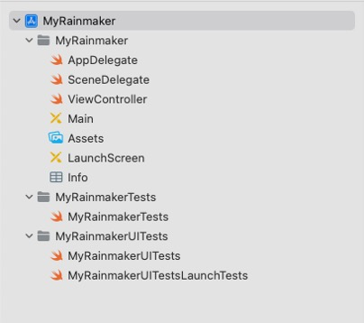

# Structure of the iOS Project

This section takes MyRainmaker Apps an example to introduce the structure of an iOS project. As the navigation view shows in Figure 10.2, the project includes a `MyRainmaker` folder for source code, a `MyRainmakerTests` folder for unit test code, and a `MyRainmakerUITests` folder for UI test code.

<figure align="center">
    
    <figcaption>Figure 10.2. Structure of the iOS project</figcaption>
</figure>

## `MyRainmaker` folder

This folder contains the `AppDelegate`, `SceneDelegate`, `ViewController`, `Main`, `Assets`, `LaunchScreen`, and `Info` files.

-   `AppDelegate`: The entry file of the entire app, which stores the
    app's delegate class.

-   `SceneDelegate`: New class added to Xcode 11 that handles scenes
    split from AppDelegate.

-   `ViewController`: Host controller class that controls view display
    and handles touch events, etc.

-   `Main`: The main interface storyboard, which contains view
    controller scenes in the app and describes the connection between
    multiple view controllers.

-   `Assets`: The file that stores most images.

-   `LaunchScreen`: Configures the app's launch screen.

-   `Info`: Configures app permissions, such as Bluetooth, location, and
    camera permissions.

## Test files

`MyRainmakerTests`, `MyRainmakerUITests`, and `MyRainmakerUITestsLaunchTests` are all test classes. They are not commonly used in project development, and thus are not explained in detail.
