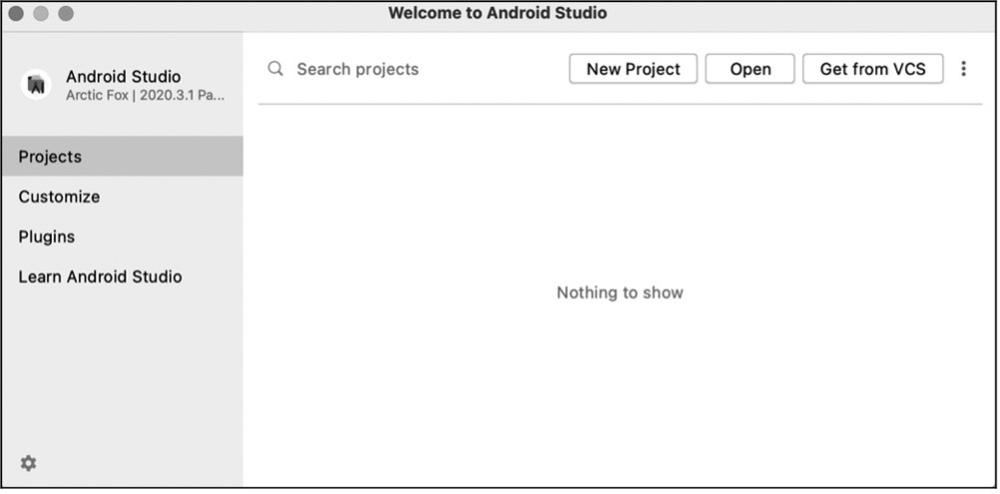
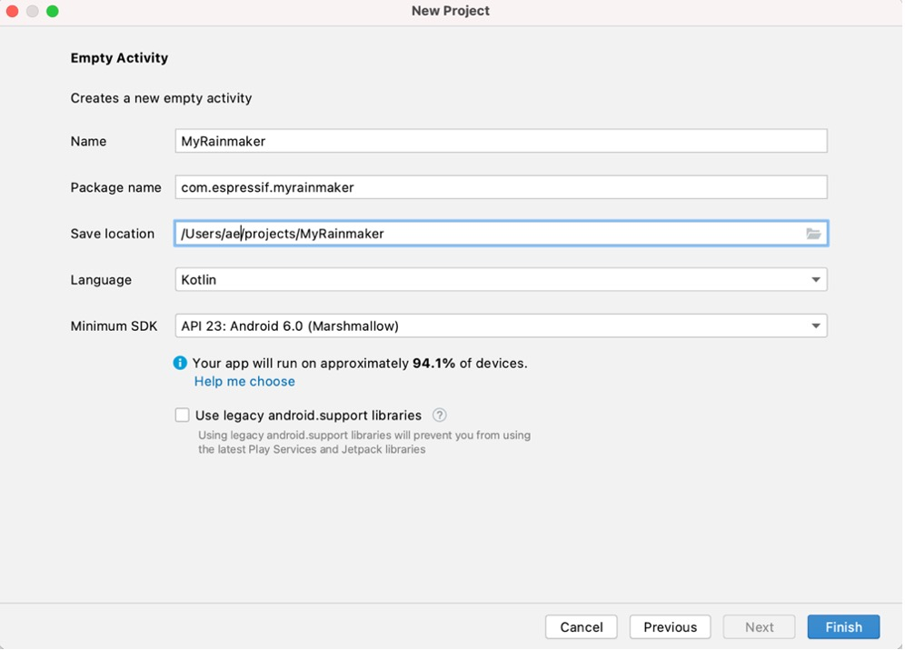

# Creating a New Android Project

To create a new Android project, proceed as follows:

After downloading and installing Android Studio on your PC, open it and
you should see the interface as shown in Figure 10.5. Then click "New
Project".

<figure align="center">
    
    <figcaption>Figure 10.5. Interface of Android Studio</figcaption>
</figure>

Select "Empty Activity", click "Next", and a "New Project" box as
Figure 10.6 will pop up.

Specify the Name of your project (e.g.,
MyRainmaker) and the Package name, and set the Save location, the
Language (Kotlin), and the Minimum SDK (Android 6.0 and above). Then
click "Finish" to create a new project.

If you are creating a project for the first time, it may take some time to
automatically download all the dependencies, so please be patient.

<figure align="center">
    
    <figcaption>Figure 10.6. The "New Project" setting box</figcaption>
</figure>
