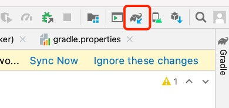

# Adding Dependencies for MyRainmaker

Add repository to `settings.gradle` (Project Settings).

```c
repositories {
    ...
    maven { url 'https://jitpack.io' }
}
```

Add dependencies to `build.gradle` (Module: MyRainmaker.app).

```c
dependencies {
    implementation 'org.greenrobot:eventbus:3.2.0'
    implementation 'com.github.espressif:
                    esp-idf-provisioning-android:lib-2.0.11'
    implementation 'com.github.espressifApp:rainmaker-proto-java:1.0.0'
    implementation 'com.google.protobuf:protobuf-javalite:3.14.0'
    implementation 'com.google.crypto.tink:tink-android:1.6.1'
}
```

Click "Sync Now" or the "" (Sync) button in the upper right corner to download the dependencies, as shown in Figure 10.7.

<figure align="center">
    
    <figcaption>Figure 10.7. Download dependencies</figcaption>
</figure>
