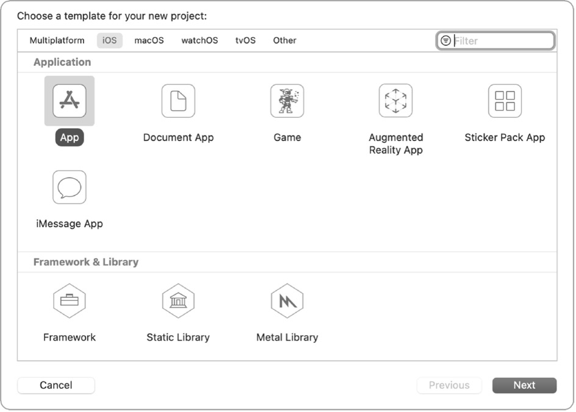
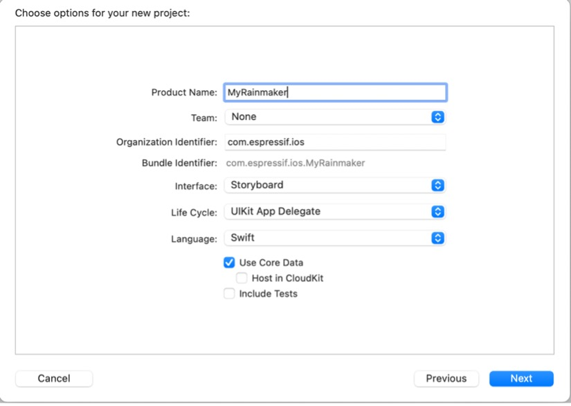

# Creating a New iOS Project

To create a new iOS project, proceed as follows:

After downloading and installing Xcode on your PC, open it, click
"Create a new Xcode project", select "iOS" → "App" as shown in Figure
10.8, and click "Next". You should see a new prompt for your project
details.

<figure align="center">
    
    <figcaption>Figure 10.8. Select "iOS" → "App"</figcaption>
</figure>

Set the Product Name (e.g., MyRainmaker), Team, Organization Identifier,
Interface, Life Cycle, and Language (Swift), as shown in Figure 10.9.

<figure align="center">
    
    <figcaption>Figure 10.9. Set project details</figcaption>
</figure>

Click "Next", and you should see a prompt for the project's location.
Set the storage path and click "Create".
