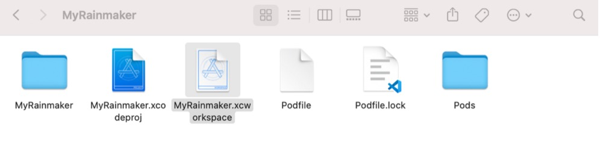
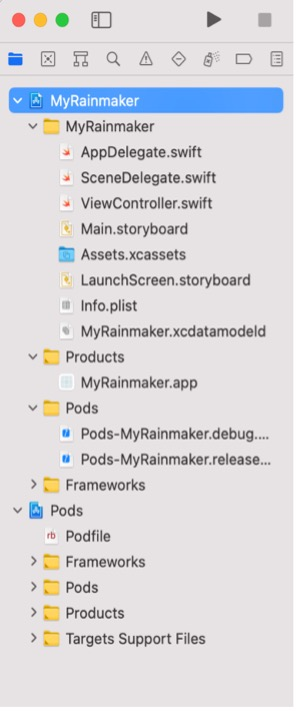

# Adding Dependencies for MyRainmaker

Open the terminal, navigate to the project directory, and execute the
following command to generate a `Podfile`.

<pre><code>% <b>touch Podfile</b></code></pre>

Open the `Podfile` and add dependencies.

```c
# Uncomment the next line to define a global platform for your project platform :ios, '12.0'

target 'ESPRainMaker' do
    # Comment the next line if you're not using Swift and don't want to use dynamic frameworks
    use_frameworks!

    # Pods for ESPRainMaker

    pod 'MBProgressHUD', '~> 1.1.0'
    pod 'Alamofire', '~> 5.0.0'
    pod 'Toast-Swift'
    pod 'ReachabilitySwift'
    pod 'JWTDecode', '~> 2.4'
    pod 'M13Checkbox'
    pod 'ESPProvision'
    pod 'DropDown'
    pod 'FlexColorPicker'

end

post_install do |installer|
    .pods_project.targets.each do |target|
        target.build_configurations.each do |config|
            config.build_settings['IPHONEOS_DEPLOYMENT_TARGET'] = '12.0'
        end
    end
end
```

Execute the following command to download dependencies.

<pre><code>% <b>pod install</b></code></pre>

After download, open the project folder and double-click `MyRainmaker.xcworkspace` to open the project, as shown in Figure 10.10.

<figure align="center">
    
    <figcaption>Figure 10.10. Double-click <code>MyRainmaker.xcworkspace</code></figcaption>
</figure>

The structure of the project is shown in Figure 10.11.

<figure align="center">
    
    <figcaption>Figure 10.11. Structure of the project</figcaption>
</figure>
