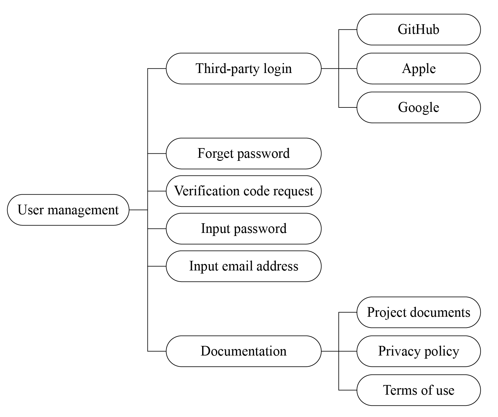

# Analysis of User Management Requirements

User registration and login are implemented in one interface and
switched through the toggle button. The critical part of this module is
to allow third-party accounts, and the network requests for
registration, login, verification code acquisition, etc., and data
parsing. The analysis of user management requirements is shown in Figure
10.13.

<figure align="center">
    
    <figcaption>Figure 10.13. Analysis of user management requirements</figcaption>
</figure>

-   To log in with a third-party account such as GitHub, Apple, or
    Google, the app will first open a webpage in the browser and obtain
    the unique identifier of the account.

-   Forgot password and verification code request can be implemented via
    corresponding cloud APIs.

-   Passwords entered will be displayed by default in ciphertext and can
    be switched to plaintext for confirmation by clicking the toggle
    (eye icon).

-   Email addresses entered will be validated using regular expressions.

-   Documentation will include documents for the entire project and can
    be accessed from various places in the app.
