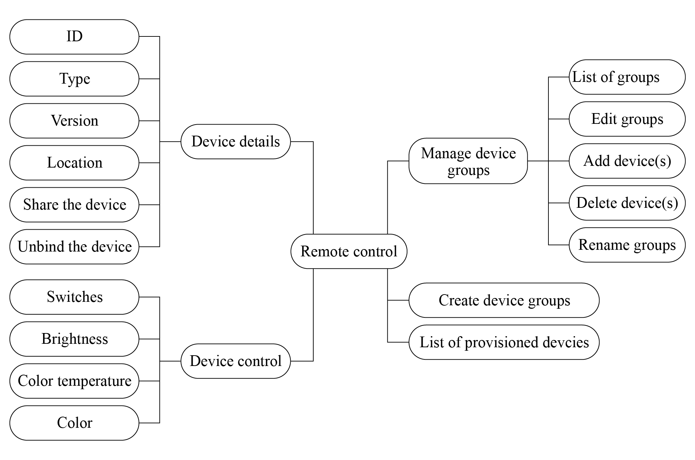

# Analysis of Remote-Control Requirements

Once the device gets provisioned and bound, users will be able to use
the smartphone app to monitor and control it remotely. In addition,
users can also control multiple devices at the same time and create
groups to manage them. The analysis of remote-control requirements is
shown in Figure 10.15.

<figure align="center">
    
    <figcaption>Figure 10.15. Analysis of remote-control requirements</figcaption>
</figure>

-   In the smartphone app, all the provisioned devices will be displayed
    in a list and can be turned on/off easily.

-   By selecting a specified device, users will enter its independent
    control interface, which varies for each device type. For example,
    it might be used to control switches, brightness, and color.

-   The device details interface will show device ID, type, version,
    location, etc., and allow users to analyze and unbind devices.

-   By creating groups, devices can be controlled and managed together.
