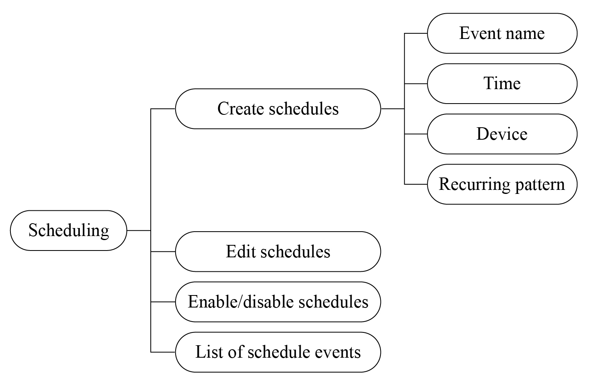

# Analysis of Scheduling Requirements

The scheduling function is relatively simple, very similar to alarm
clocks we use every day. It mainly includes functions like creating
schedules, list of schedule events, editing schedules,
enabling/disabling schedules, etc. The analysis of scheduling
requirements is shown in Figure 10.16. The details of a schedule refer
to its event name, date, time, recurring pattern, etc.

<figure align="center">
    
    <figcaption>Figure 10.16. Analysis of scheduling requirements</figcaption>
</figure>
