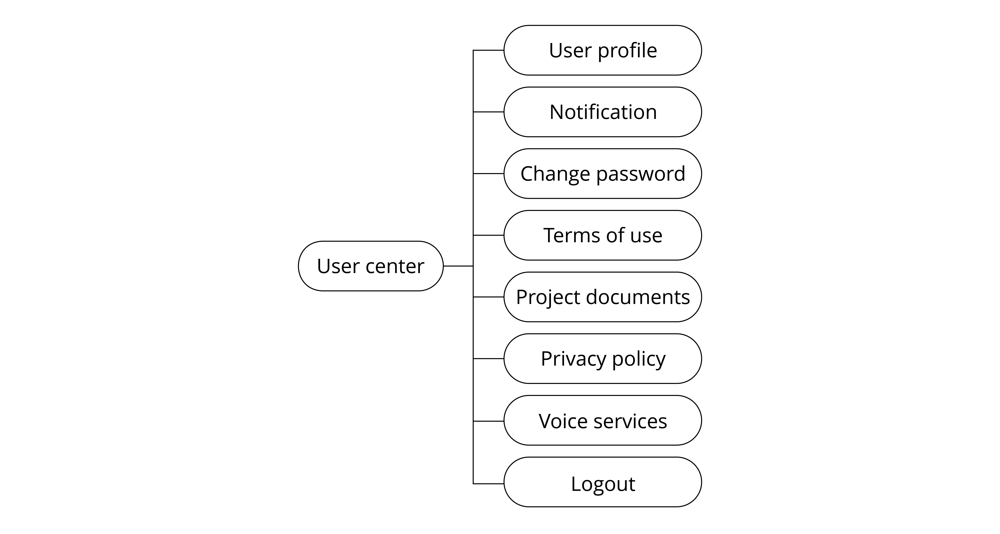

# Analysis of User Center Requirements

The user center module mainly features user profile, notification,
changing password, terms of use, project documents, privacy policy,
voice services, and logout. Note that the changing password and logout
functions need to call the cloud API. The analysis of user center
requirements is shown in Figure 10.17.

<figure align="center">
    
    <figcaption>Figure 10.17. Analysis of user center requirements</figcaption>
</figure>
