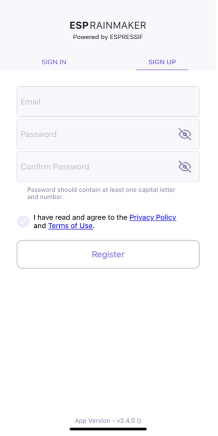

# Account Registration

First, we need to implement the registration of a new account, which
will be used to bind the device in subsequent steps and control it
remotely. In this project, the account is registered via email address.

There is a toggle button in the registration interface to switch between
"SIGN IN" and "SIGN UP". For the SIGN UP interface, there are three
input fields: Email, Password, and Confirm Password. The content of the
Password and Confirm Password fields can be shown or hidden by toggling
their visibility, so that users can check whether they have entered the
correct password. The password should contain at least one uppercase
letter and a number.

<figure align="center">
    
    <figcaption>Figure 10.18. SIGN UP interface</figcaption>
</figure>

Before clicking "Register", users must read and agree to the Privacy
Policy and Terms of Use. Then, it will navigate to a verification
interface, and a digital code will be sent to the email address. Users
need to enter the correct digital code to complete the registration
procedure. The SIGN UP interface is shown in Figure 10.18.

Figure 10.19 demonstrates the API for account registraion. For detailed
information, please refer to <https://swaggerapis.rainmaker.espressif.com/#/User/usercreation>.

<figure align="center">
    
    <figcaption>Figure 10.19. API for account registration</figcaption>
</figure>

The account registration function is implemented as follows:

**Create a new account.**

Below shows the account registration API, where `user_name` refers to the email address used for registration, and `password` to the password.

```c
POST /v1/user
Content-Type: application/json

{
    "user_name": "username@domain.com",
    "password": "password"
}
```

To create a new account in Android, use:

```c
@POST
Call<ResponseBody> createUser(@Url String url, @Body JsonObject body);
```

> 📝 **Source code**
>
> For the source code of creating a new account in Android, please refer to [`book-esp32c3-iot-projects/phone_app/app_android/app/src/main/java/com/espressif/cloudapi/ApiInterface.java`](https://github.com/espressif/book-esp32c3-iot-projects/blob/main/phone_app/app_android/app/src/main/java/com/espressif/cloudapi/ApiInterface.java).

To create a new account in iOS, use:

```c
func createNewUser(name: String, password: String) {
    apiWorker.callAPI(endPoint: .createNewUser(url: self.url, name: name,
            password: password), encoding: JSONEncoding.default) { data, error in
        self.apiParser.parseResponse(data, withError: error) { umError in
            self.presenter?.verifyUser(withName: name, andPassword:

}
```

> 📝 **Source code**
>
> For the source code of creating a new account in iOS, please refer to [`book-esp32c3-iot-projects/phone_app/app_ios/ESPRainMaker/ESPRainMaker/UserManagement/Interactors/ESPCreateUserService.swift`](https://github.com/espressif/book-esp32c3-iot-projects/blob/main/phone_app/app_ios/ESPRainMaker/ESPRainMaker/UserManagement/Interactors/ESPCreateUserService.swift).

**Verify the account after receiving the digital code.**

Below shows details of the API, where `user_name` refers to the email address used for registration, and `verification_code` to the digital code.

```c
POST /v1/user
Content-Type: application/json

{
    "user_name": "username@domain.com",
    "verification_code": "verification_code"
}
```

To verify the account with digital code in Android, use:

```c
@POST
Call<ResponseBody> confirmUser(@Url String url, @Body JsonObject body);
```

> 📝 **Source code**
>
> For the source code of verifying the account in Android, please refer to [`book-esp32c3-iot-projects/phone_app/app_android/app/src/main/java/com/espressif/cloudapi/ApiInterface.java`](https://github.com/espressif/book-esp32c3-iot-projects/blob/main/phone_app/app_android/app/src/main/java/com/espressif/cloudapi/ApiInterface.java).

To verify the account with digital code in iOS, use:

```c
func confirmUser(name: String, verificationCode: String) {
    apiWorker.callAPI(endPoint: .confirmUser(url: self.url, name: name,
                        verificationCode: verificationCode),
                        encoding: JSONEncoding.default) { data, error in
        self.apiParser.parseResponse(data, withError: error) { umError in
            self.presenter?.userVerified(withError: umError)
        }
    }
}
```

> 📝 **Source code**
>
> For the source code of verifying the account in iOS, please refer to [`book-esp32c3-iot-projects/phone_app/app_ios/ESPRainMaker/ESPRainMaker/UserManagement/Interactors/ESPCreateUserService.swift`](https://github.com/espressif/book-esp32c3-iot-projects/blob/main/phone_app/app_ios/ESPRainMaker/ESPRainMaker/UserManagement/Interactors/ESPCreateUserService.swift).
