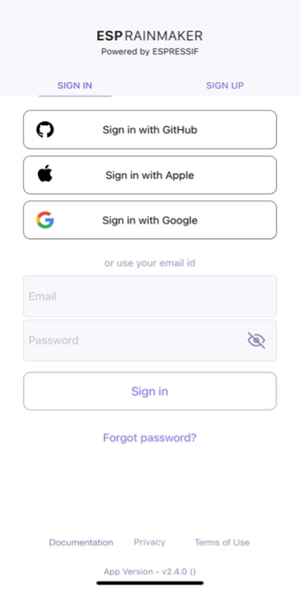

# Account Login

After account registration, we can call the account login API to get the `token` for authentication and the basic profile.

The smartphone app project in this chapter supports login via
third-party accounts such as GitHub, Apple, and Google. So long as users
have accounts of these three platforms, they can log in directly in the
app without registration.

If users have already registered new accounts, they can also log in to
the app by entering their email address and password.

If users forget their password, they can click "Forgot password?" under
the "Sign in" button to reset password.

At the bottom of the SIGN IN interface are the project-related
documentation, privacy agreement, terms of use, and the app version. The
SIGN IN interface is shown in Figure 10.20.

<figure align="center">
    
    <figcaption>Figure 10.20. SIGN IN interface</figcaption>
</figure>

The account login function is implemented as follows:

**Request an access token.**

The API is shown in Figure 10.21 and details can be found at <https://swaggerapis.rainmaker.espressif.com/#/User/login>.

<figure align="center">
    
    <figcaption>Figure 10.21. API for account login</figcaption>
</figure>

``` c
POST /v1/login
Content-Type: application/json

{
    "user_name": "username@domain.com",
    "password": "password"
}
```

The server responds to the request as follows:

```c
{
    "status": "success",
    "description": "Login successful",
    "idtoken": "idtoken",
    "accesstoken": "accesstoken",
    "refreshtoken": "refreshtoken"
}
```

Among these fields, `status` tells whether the request is successful;
`description` provides details of the request; `accesstoken` is the
token to be added to the HTTP request header by all APIs requiring user
permissions, in the format of `Authorization:$acces-stoken`; `idtoken` and `refreshtoken` are not used for now and thus not
explained here.

To request `access token` in Android, use:

```c
@POST
Call<ResponseBody> login(@Url String url, @Body JsonObject body);
```

> 📝 **Source code**
>
> For the source code of requesting access token in Android, please
> refer to [`book-esp32c3-iot-projects/phone_app/app_android/app/src/main/java/com/espressif/cloudapi/ApiInterface.java`](https://github.com/espressif/book-esp32c3-iot-projects/blob/main/phone_app/app_android/app/src/main/java/com/espressif/cloudapi/ApiInterface.java).

To request `access token` in iOS, use:

```c
func loginUser(name: String, password: String) {
    apiWorker.callAPI(endPoint: .loginUser(url: self.url,
                    name: name, password: password),
                    encoding: JSONEncoding.default) { data, error in
        self.apiParser.parseExtendSessionResponse(data,
                                        error: error) { _, umError in
            self.presenter?.loginCompleted(withError: umError)
        }
    }
}
```

> 📝 **Source code**
>
> For the source code of requesting access token in iOS, please refer to
> [`book-esp32c3-iot-projects/phone_app/app_ios/ESPRainMaker/ESPRainMaker/UserManagement/Interactors/ESPLoginService.swift`](https://github.com/espressif/book-esp32c3-iot-projects/blob/main/phone_app/app_ios/ESPRainMaker/ESPRainMaker/UserManagement/Interactors/ESPLoginService.swift).

**Get user profile.**

The API is shown in Figure 10.22 and details can be found at <https://swaggerapis.rainmaker.espressif.com/#/User/getUser>.

<figure align="center">
    
    <figcaption>Figure 10.22. API to get user profile</figcaption>
</figure>

```c
GET /v1/user
Authorization: $accesstoken
```

In response to the "get user profile" request, the server returns:

```c
{
    "user_id": "string",
    "user_name": "string",
    "super_admin": true,
    "picture_url": "string",
    "name": "string",
    "mfa": true,
    "phone_number": "<+Mobile Number with country code>"
}
```

Among these fields, `user_id` is the user's unique identifier and will
be used later in provisioning; `user_name` refers to the account;
`super_admin` is returned `true` only when the user is a super admin;
`picture_url` points to the user's profile picture; `phone_number` is
the user's mobile phone number; `name` and `mfa` are not used in this
project and thus not explained here.

To get user profile in Android, use:

```c
@GET
Call<ResponseBody> fetchUserDetails(@Url String url);
```

> 📝 **Source code**
>
> For the source code of getting user profile in Android, please refer to [`book-esp32c3-iot-projects/phone_app/app_android/app/src/main/java/com/espressif/cloudapi/ApiInterface.java`](https://github.com/espressif/book-esp32c3-iot-projects/blob/main/phone_app/app_android/app/src/main/java/com/espressif/cloudapi/ApiInterface.java).

To get user profile in iOS, use:

```c
func fetchUserDetails() {
    sessionWorker.checkUserSession { accessToken, error in
        if let token = accessToken, token.count > 0 {
            self.apiWorker.callAPI(endPoint: .fetchUserDetails(url: self.url,
                                    accessToken: token), encoding:
                                    JSONEncoding.default) { data, error in
                self.apiParser.parseUserDetailsResponse(data,
                                        withError: error) { umError in
                    self.presenter?.userDetailsFetched(error: umError)
                    return
                }
            }
        } else {
            self.presenter?.userDetailsFetched(error: error)
        }
    }
}
```

> 📝 **Source code**
>
> For the source code of getting user profile in iOS, please refer to [`book-esp32c3-iot-projects/phone_app/app_ios/ESPRainMaker/ESPRainMaker/UserManagement/Interactors/ESPUserService.swift`](https://github.com/espressif/book-esp32c3-iot-projects/blob/main/phone_app/app_ios/ESPRainMaker/ESPRainMaker/UserManagement/Interactors/ESPUserService.swift).
