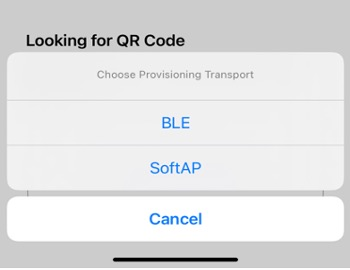

# Scanning Devices

Navigate to the homepage of the app, click the button in the upper right corner, and the camera will be called to scan QR Code on devices. This is the fastest way to discover a smart device. Except for QR code scanning, users can also discover devices through BLE or SoftAP provisioning. The device scanning interface is shown in Figure 10.24. (The actual interface may be different from the screenshots in this book due to application upgrades.)

<figure align="center">
    
    <figcaption>Figure 10.24. Device scanning interface</figcaption>
</figure>

In the following sections, we will take Bluetooth provisioning as an example to introduce the process of device provisioning.

## Scanning devices in Android

Users should upgrade their phones to Android 9.0 or higher and enable GPS to search for Bluetooth LE signals. The code is as follows:

> 📝 **Source code**
>
> For the source code of scanning devices in Android, please refer to [`book-esp32c3-iot-projects/phone_app/app_android/app/src/main/java/com/espressif/ui/activities/BLEProvisionLanding.java`](https://github.com/espressif/book-esp32c3-iot-projects/blob/main/phone_app/app_android/app/src/main/java/com/espressif/ui/activities/BLEProvisionLanding.java).

```c
private void startScan() {
    //Code Omitted
    if (ActivityCompat.checkSelfPermission(this,
                            Manifest.permission.ACCESS_FINE_LOCATION) ==
                            PackageManager.PERMISSION_GRANTED) {
        provisionManager.searchBleEspDevices(deviceNamePrefix, bleScanListener);
        updateProgressAndScanBtn();
    } else {
        //Code Omitted
    }
}

private BleScanListener bleScanListener = new BleScanListener() {
    @Override
    public void scanStartFailed() {
    Toast.makeText(BLEProvisionLanding.this,
                        "Please turn on Bluetooth to connect BLE device",
                        Toast.LENGTH_SHORT).show();
    }

    @Override
    public void onPeripheralFound(BluetoothDevice device, ScanResult scanResult) {
        //Code Omitted
    }

    @Override
    public void scanCompleted() {
        //Code Omitted
    }

    @Override
    public void onFailure(Exception e) {
        //Code Omitted
    }
};
```

## Scanning devices in iOS

In the following code, `prefix` is used to filter devices by names. If a device has its unique identifier, it can be used for filtering. iOS code has an additional parameter `transport` with two possible values: `ble` and `softap`, which refers to the two provisioning methods.

> 📝 **Source code**
>
> For the source code of scanning devices in iOS, please refer to [`book-esp32c3-iot-projects/phone_app/app_ios/ESPRainMaker/ESPRainMaker/Interface/Provision/BLE/BLELandingViewController.swift`](https://github.com/espressif/book-esp32c3-iot-projects/blob/main/phone_app/app_ios/ESPRainMaker/ESPRainMaker/Interface/Provision/BLE/BLELandingViewController.swift).

```c
ESPProvisionManager.shared.searchESPDevices(devicePrefix: "prefix", transport: .ble,
                        security: Configuration.shared.espProvSetting.securityMode){
    bleDevices, _ in
    //Code Omitted
}
```
