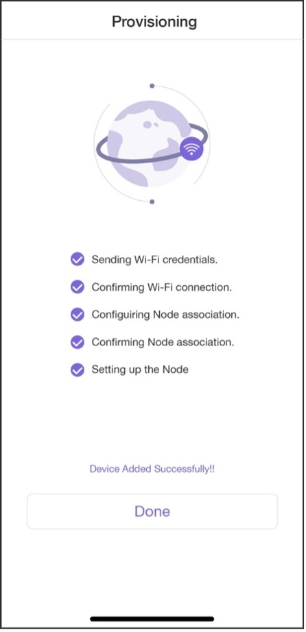

# Provisioning Devices

Once the smartphone app establishes a connection with the device, we can implement protocols through Bluetooth communication, provision the device, and activate the device on the cloud. The entire provisioning process consists of five steps as listed in Figure 10.25.

<figure align="center">
    
    <figcaption>Figure 10.25. Device provisioning interface</figcaption>
</figure>

## Provisioning devices in Android

> 📝 **Source code**
>
> For the source code of provisioning in Android, please refer to [`book-esp32c3-iot-projects/phone_app/app_android/app/src/main/java/com/espressif/ui/activities/ProvisionActivity.java`](https://github.com/espressif/book-esp32c3-iot-projects/blob/main/phone_app/app_android/app/src/main/java/com/espressif/ui/activities/ProvisionActivity.java).

```c
private void provision() {

    provisionManager.getEspDevice().provision(ssidValue, passphraseValue, new ProvisionListener() {
        @Override
        public void createSessionFailed(Exception e) {}
        @Override
        public void wifiConfigSent() {}
        @Override
        public void wifiConfigFailed(Exception e) {}
        @Override
        public void wifiConfigApplied() {}
        @Override
        public void wifiConfigApplyFailed(Exception e) {}
        @Override
        public void provisioningFailedFromDevice(final ESPConstants.Provision FailureReason failureReason) {}
        @Override
        public void deviceProvisioningSuccess() {
            // Provisioning succeeded.
        }
        @Override
        public void onProvisioningFailed(Exception e) {}
    });
}
```

## Provisioning devices in iOS

> 📝 **Source code**
>
> For the source code of provisioning in iOS, please refer to [`book-esp32c3-iot-projects/phone_app/app_ios/ESPRainMaker/ESPRainMaker/Interface/Provision/SuccessViewController.swift`](https://github.com/espressif/book-esp32c3-iot-projects/blob/cf25c67fbcedc44394fd7f90637b745d659f80ff/phone_app/app_ios/ESPRainMaker/ESPRainMaker/Interface/Provision/SuccessViewController.swift).

```c
espDevice.provision(ssid: ssid, passPhrase: passphrase) { status in
    switch status {
    case .success:
    //Provisioning succeeded.
    case let .failure(error):
        switch error {
            case .configurationError:
            case .sessionError:
            case .wifiStatusDisconnected:
            default:
        }
    case .configApplied:
    }
}
```

Once the device is provisioned, we are ready to develop the device
control function of the smartphone app.
