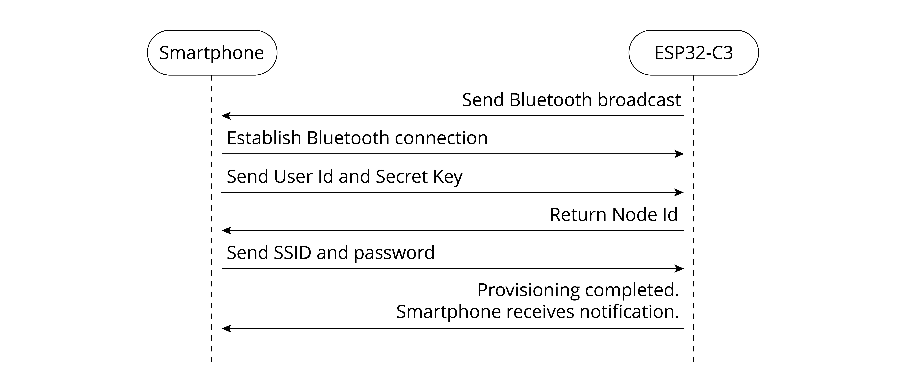

# Development of Device Provisioning

As described in Section 10.4, we can get `access token` and `user_id` of the RainMaker account through APIs for account login and getting user profile. The next step is to find the device, connect it to the router, and activitate it on the cloud. The suitable provisioning library for the app is `idf-provisioning`, which is encapsulated based on ESP-IDF provisioning.

For provisioning methods, please refer to <https://bookc3.espressif.com/provisioning>.

Figure 10.23 illustrates the data exchange between the smartphone and
the device during provisioning. This is also mentioned in Section 7.3.4
Bluetooth Provisioning.

<figure align="center">
    
    <figcaption>Figure 10.23. Data exchange between smartphone and device during provisioning</figcaption>
</figure>
