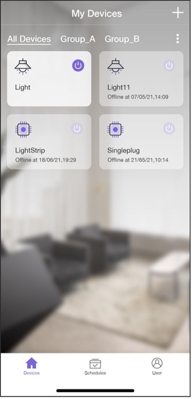

# Getting a List of Devices

When users get all the devices bound to the account, the smartphone app
would show them in a list. At the top of the interface, there are
several toggles for device groups. By default, all the devices will
appear in the "All Devices" group. If users want to assign the devices
to different groups, they may click the "" icon on the right and will then see the options to manage and create groups.

<figure align="center">
    
    <figcaption>Figure 10.27. Interface showing the list of all bound devices</figcaption>
</figure>

Devices grayed out indicate powered down and offline, while devices
highlighted indicate available online. The device card includes device
type icon, device name, offline time, and a toggle switch. Figure 10.27
shows an example list of all devices bound to the account.

The API to get all the bound devices is shown in Figure 10.28 and can be
found at <https://swaggerapis.rainmaker.espressif.com/#/User%20Node%20Association/getUserNodeMappingRequestStatus>.

<figure align="center">
    
    <figcaption>Figure 10.28. API to get bound devices</figcaption>
</figure>

```c
GET /v1/user/nodes?node_details=true
Authorization: $accesstoken
```

In response to the request, the server returns:

```c
{
    "nodes": "[ nodeid1, ... ]",
    "node_details": [
    {
        "id": "nodeid1",
        "role": "primary",
        "status": {
        "connectivity": {
                "connected": true,
                "timestamp": 1584698464101
            }
        },
        "config": {
            "node_id": "nodeid1",
            "config_version": "config_version",
            "devices": [
            {}
            ],
            "info": {
                "fw_version": "fw_version",
                "name": "node_name",
                "type": "node_type"
            }
        },
        "params": {
            "Light": {
                "brightness": 0,
                "output": true
            },
            "Switch": {
                "output": true
            }
        }
    }
    ],
    "next_id": "nodeid1",
    "total": 5
}
```

Among these returned fields, `nodes` is an array of all the devices' ID; `node_details` is the detailed information of the devices, which includes `id` (unique identifier), `role`, `status` (connection status), `config` (configuration), `params` (device properties), etc.; `total` is the number of devices and is returned when device information spread across pages.

## Getting device information in Android

> 📝 **Source code**
>
> For the source code of getting device information in Android, please refer to [`book-esp32c3-iot-projects/phone_app/app_android/app/src/main/java/com/espressif/cloudapi/ApiManager.java`](https://github.com/espressif/book-esp32c3-iot-projects/blob/main/phone_app/app_android/app/src/main/java/com/espressif/cloudapi/ApiManager.java).

```c
private void getNodesFromCloud(final String startId, final ApiResponseListener listener) {

    Log.d(TAG, "Get Nodes from cloud with start id : " + startId);
    apiInterface.getNodes(AppConstants.URL_USER_NODES_DETAILS, accessToken,
                        startId).enqueue(new Callback<ResponseBody>() {
        @Override
        public void onResponse(Call<ResponseBody> call, Response<ResponseBody> response) {
            //Code Omitted
        }
        @Override
        public void onFailure(Call<ResponseBody> call, Throwable t) {
            t.printStackTrace();
            listener.onNetworkFailure(new Exception(t));
        }
    });
}
```

## Getting device information in iOS

> 📝 **Source code**
>
> For the source code of getting device information in iOS, please refer to [`book-esp32c3-iot-projects/phone_app/app_ios/ESPRainMaker/ESPRainMaker/AWSCognito/ESPAPIManager.swift`](https://github.com/espressif/book-esp32c3-iot-projects/blob/cf25c67fbcedc44394fd7f90637b745d659f80ff/phone_app/app_ios/ESPRainMaker/ESPRainMaker/AWSCognito/ESPAPIManager.swift).

```c
func getNodes(partialList: [Node]? = nil, nextNodeID: String? = nil,
     completionHandler: @escaping ([Node]?, ESPNetworkError?) -> Void) {
    let sessionWorker = ESPExtendUserSessionWorker()
    sessionWorker.checkUserSession() { accessToken, error in
        if let token = accessToken {
            let headers: HTTPHeaders = ["Content-Type": "application/json",
                                        "Authorization": token]
            var url=Constants.getNodes + "?node_details=true&num_records=10"
            if nextNodeID ! = nil {
                url += "&start_id=" + nextNodeID!
            }
            self.session.request(url, method: .get, parameters: nil,
                                encoding: JSONEncoding.default, 
                                headers: headers).responseJSON { response in
                //Code Omitted
            }
        } else {
            if self.validatedRefreshToken(error: error) {
                completionHandler(nil, .emptyToken)
            }
        }
    }
}
```
