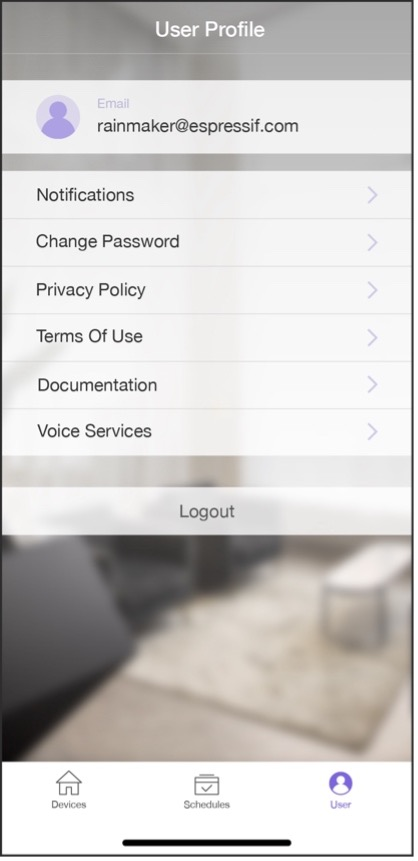

# Implementing User Center

The user center module mainly includes functions like user profile,
notification, change password, privacy policy, terms of use,
documentation, voice services, and logout. The user center interface is
shown in Figure 10.33.

<figure align="center">
    
    <figcaption>Figure 10.33. User center interface</figcaption>
</figure>

Among these functions, change password and logout need to be implemented
by calling cloud APIs. In this section, we will take change password as
an example of implementing user center functions. The interface for
changing password is shown in Figure 10.34.

<figure align="center">
    
    <figcaption>Figure 10.34. API for changing password</figcaption>
</figure>

```c
PUT /v1/password
Authorization: $accesstoken
{
    "password": "password",
    "newpassword": "newpassowrd"
}
```

In the code above, `password` refers to the old password, which aids the
cloud in changing password; `newpassword` refers to the new password.
Once the password has been changed, the new password should come into
use, and the old one becomes invalid.

In response to the request, the server returns:

```c
{
    "status": "success",
    "description": "Success description"
}
```

Among the returned fields, `status` indicates the status of changing
password; `description` indicates the description of the change
request.

## Changing password in Android

> 📝 **Source code**
>
> For the source code of changing password in Android, please refer to [`book-esp32c3-iot-projects/phone_app/app_android/app/src/main/java/com/espressif/cloudapi/ApiManager.java`](https://github.com/espressif/book-esp32c3-iot-projects/blob/main/phone_app/app_android/app/src/main/java/com/espressif/cloudapi/ApiManager.java).

```c
Public void changePassword(String oldPassword, String newPassword, final ApiResponseListener listener) {

    JsonObject body = new JsonObject();
    body.addProperty(AppConstants.KEY_PASSWORD, oldPassword);
    body.addProperty(AppConstants.KEY_NEW_PASSWORD, newPassword);

    apiInterface.changePassword(AppConstants.URL_CHANGE_PASSWORD, accessToken, 
                                body).enqueue(new Callback<ResponseBody>() {

        @Override
        public void onResponse(Call<ResponseBody> call, Response<ResponseBody> response) {
            //Code Omitted
        }

        @Override
        public void onFailure(Call<ResponseBody> call, Throwable t) {
            t.printStackTrace();
            listener.onNetworkFailure(new RuntimeException("Failed to change password"));
        }
    });
}
```

## Changing password in iOS

> 📝 **Source code**
>
> For the source code of changing password in iOS, please refer to [`book-esp32c3-iot-projects/phone_app/app_ios/ESPRainMaker/ESPRainMaker/UserManagement/Interactors/ESPChangePasswordService.swift`](https://github.com/espressif/book-esp32c3-iot-projects/blob/cf25c67fbcedc44394fd7f90637b745d659f80ff/phone_app/app_ios/ESPRainMaker/ESPRainMaker/UserManagement/Interactors/ESPChangePasswordService.swift).

```c
func changePassword(oldPassword: String, newPassword: String) {
    sessionWorker.checkUserSession() { accessToken, sessionError in
        if let token = accessToken {
            self.apiWorker.callAPI(endPoint: .changePassword(url: self.url, old: oldPassword, 
                                new: newPassword, accessToken: token), 
                                encoding: JSONEncoding.default) { data, error in
                self.apiParser.parseResponse(data, withError: error) { umError in
                    self.presenter?.passwordChanged(withError: umError)
                }
            }
        } else {
            if !self.apiParser.isRefreshTokenValid(serverError:sessionError) {
                if let error = sessionError {
                    self.noRefreshSignOutUser(error: error)
                }
            } else {
                self.presenter?.passwordChanged(withError: sessionError)
            }
        }
    }
}
```
