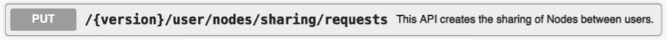
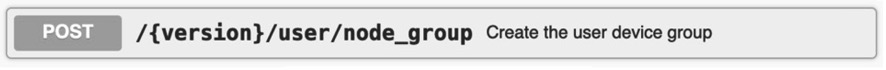
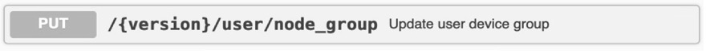

# More Cloud APIs

In addition to the APIs detailed in the previous sections, RainMaker
also provides some other APIs. Let's have a quick look at them.

## Sharing devices with other users

The API to share devices with other users is shown in Figure 10.35 and can be found at <https://swaggerapis.rainmaker.espressif.com/#/User%20Node%20Association/addUserNodeSharingRequests>.

<figure align="center">
    
    <figcaption>Figure 10.35. API for sharing devices with other users</figcaption>
</figure>

## Getting the online/offline status of the device

The API to get the online/offline status of the device is shown in Figure 10.36 and can be found at <https://swaggerapis.rainmaker.espressif.com/#/User%20Node%20Association/getNodeStatus>.

<figure align="center">
    
    <figcaption>Figure 10.36. API for getting online/offline status of the device</figcaption>
</figure>

## Creating device groups

The API to create device groups is shown in Figure 10.37 and can be found at <https://swaggerapis.rainmaker.espressif.com/#/Device%20grouping/usercreatedevicegroup>.

<figure align="center">
    
    <figcaption>Figure 10.37. API for creating device groups</figcaption>
</figure>

## Adding device to a group

The API to add a device to a group is shown in Figure 10.38 and can be found at <https://swaggerapis.rainmaker.espressif.com/#/Device%20grouping/userupdatedevicegroup>.

<figure align="center">
    
    <figcaption>Figure 10.38. API for adding device to a group</figcaption>
</figure>

## Deleting device groups

The API to delete device groups is shown in Figure 10.39 and can be found at <https://swaggerapis.rainmaker.espressif.com/#/Device%20grouping/userdeletedevicegroup>.

<figure align="center">
    
    <figcaption>Figure 10.39. API for deleting device groups</figcaption>
</figure>

  
Of course, RainMaker can do much more than what we have introduced. If
interested, you may check the API documentation to discover more fun
features!
