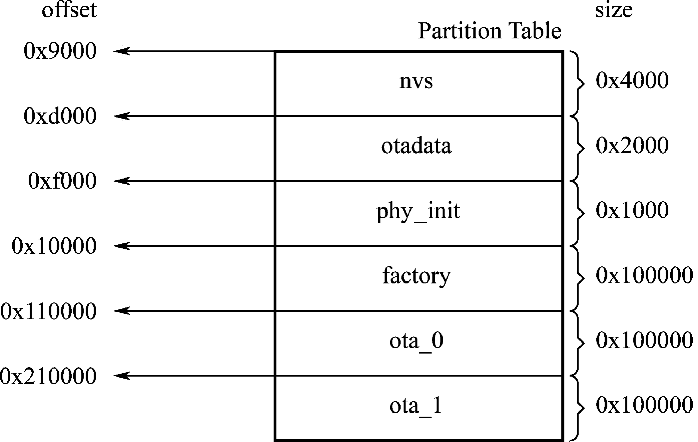

# Overview of Partition Tables

The partition tables in ESP-IDF refer to the descriptive files that divide the flash into specific functional areas at the user level. This book takes [`advanced_https_ota`](https://github.com/espressif/esp-idf/tree/master/examples/system/ota/advanced_https_ota) as an example, abbreviated as the OTA upgrade example. In this example, the [`partitions_two_ota.csv`](https://github.com/espressif/esp-idf/blob/master/components/partition_table/partitions_two_ota.csv) file under the `partition_table` component in ESP-IDF is used by default. The following is a summary of the `partitions_two_ota.csv` partition table.

```
# Name,     Type,   SubType,    Offset, Size,   Flags
# Note: if you have increased the bootloader size, make sure to update the offsets to avoid overlap
nvs,        data,   nvs,        ,       0x4000,
otadata,    data,   ota,        ,       0x2000,
phy_init,   data,   phy,        ,       0x1000,
factory,    app,    factory,    ,       1M,
ota_0,      app,    ota_0,      ,       1M,
ota_1,      app,    ota_1,      ,       1M,
```

From the overview above, each entry in the partition table consists of `Name`, `Type`, `SubType`, `Offset`, `Size`, and `Flags`.

-   The `Name` field is used to identify the name and should not exceed
    16 bytes.

-   The `Type` field can be specified as either `app` or `data`, or a number from 0 to 254 (or the corresponding hexadecimal number 0x00 to 0xFE). It is mainly used to mark whether the stored content is an application firmware or data.

-   The length of the `SubType` field is 8 bits, and the specific marking content is related to the `Type` field.

    -   When `Type` is defined as `app`, `SubType` can be specified as `factory(0x00)`, `ota_0(0x10)`, ..., `ota_15(0x1F)`, or `test(0x20)`.

    -   When `Type` is defined as `data`, `SubType` can be specified as
        `ota(0x00)`, `phy(0x01)`, `nvs(0x02)`, `nvs_keys(0x04)`, or a
        specific subtype for other components.

-   The `Offset` and `Size` fields are used to define a specific area.

-   The `Flags` field is used to mark whether encryption is enabled.

Without any value filled in the `Offset` field, the partition table in the example is still valid. This is because the position of the first entry in the partition table is determined, so the address of the subsequent entry can be calculated from the `Size` field of the previous entry. If the addresses of each entry in the partition table are not continuous, the `Offset` field needs to be used to mark the starting address of each entry. For easy understanding, this book has converted the example partition table into a figure, as shown in Figure 11.2.

<figure align="center">
    
    <figcaption>Figure 11.2. Schematics of the partition table</figcaption>
</figure>

From Figure 11.2, the starting address of the first entry in the
partition table is 0x9000, that is, the `Offset` field of the entry
whose `Name` is `nvs` in `partitions_two_ota.csv` is 0x9000, and the
size of this entry is 0x4000. According to the calculation rules
introduced earlier, the `Offset` of the next entry is 0x9000 + 0x4000 =
0xd000. Calculated sequentially, the `Offset` of the last `ota_1` entry
should be 0x210000.

The `partitions_two_ota.csv` partition table is divided into six areas:
three data partitions `nvs`, `otadata`, and `phy_init` are used to store NVS data, OTA data, and PHY initialisation data, respectively; and three application partitions used to store three different application firmwares. As can be seen from the basic steps of OTA, at least two OTA application partitions are required to perform OTA: `[Type (app), SubType (ota_0/ota_1)]` and one OTA data partition `[Type (data), SubType (ota)]`. It may also include an optional application partition, which is the factory application partition: `[Type (app), SubType (factory)]`.

-   The OTA data partition is used to store information about the
    currently selected OTA application partition. After the first OTA,
    the OTA data partition will be updated to specify which OTA
    application partition to boot next. The size of the OTA data
    partition needs to be set to 0x2000 to prevent problems caused by
    power failure during writing. The two sectors are erased and written
    with matching data separately. If there is an inconsistency, the
    counter field will be used to determine the sector with the latest
    data.

-   The application partition is used to store firmware. The factory
    application partition is the default application partition. If there
    is no OTA data partition or the OTA data partition is invalid, the
    firmware of the factory application partition (if it exists) will be
    used first, followed by the firmware of the OTA data partition. OTA
    will never update the contents of the factory application partition.
