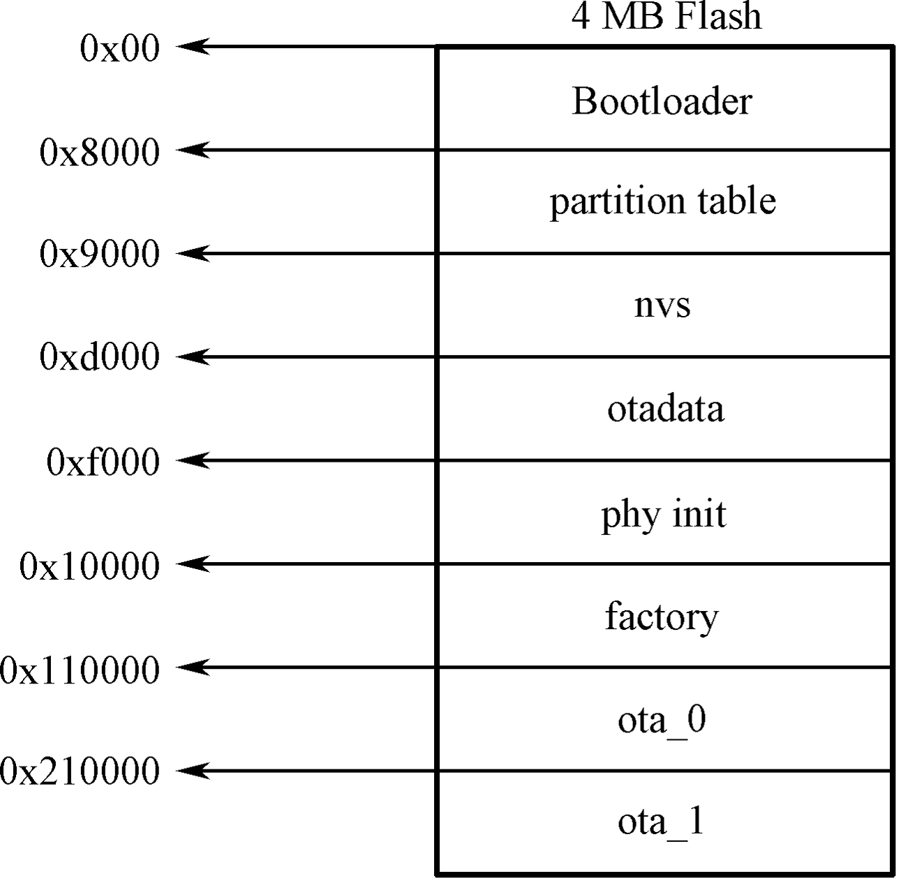

# Firmware Boot Process

In Section 11.1.1, we introduced that the starting address of the first
entry in the partition table is 0x9000. But why is the starting address
not 0x0? And why is it 0x9000? To answer these questions, let's first
look at Figure 11.3, which presents the specific contents stored in a 4
MB flash.

<figure align="center">
    
    <figcaption>Figure 11.3. Specific contents stored in a 4 MB flash</figcaption>
</figure>

As can be seen from Figure 11.3, the flash is divided into eight areas:
the address 0x00 stores the Bootloader, the address 0x8000 stores the
partition table, and the latter 6 areas, starting from 0x9000, is the
area divided by the partition table, which you may already be quite
familiar with. Now we can answer the first question. The reason why 0x0
is not the starting address is that it stores the Bootloader (not every
0x0 address of the chip flash stores the Bootloader. ESP32 series chips
store the Bootloader at 0x1000), which is used to load and boot the
application partition. In the programming design of Espressif chips,
Bootloader is called the secondary bootloader, which mainly increases
the flexibility of flash partition and facilitates the implementation of
flash encryption, secure boot, and OTA functions. The secondary
bootloader loads the partition table from the offset address of flash at
0x8000 by default. The size of the partition table is 0x1000. The
secondary bootloader will look for the factory application partition and
the OTA data partition from the partition table and determine which
partition to boot by querying the OTA data partition. Therefore, the
second question has also been answered.

The process from power-up to running the `app_main()` function on
ESP32-C3 can be divided into three steps:

1.  Bootstrapping is performed by the primary bootloader, which is
    stored in the ROM of the ESP32-C3. Upon the chip reset, the CPU
    starts running immediately to determine the boot mode and perform
    relevant operations. The secondary bootloader is then loaded into
    RAM from the offset address 0x0 of the flash.

2.  Bootstrapping is performed by the secondary bootloader. The
    secondary bootloader will first load the partition table from flash
    and then query the OTA data partition to select a firmware from a
    particular application partition for loading. When all data is
    processed, the secondary bootloader will verify the integrity of the
    firmware and look for the entry address from the header of the
    binary firmware file, and then jump to that address to execute the
    firmware. The firmware in the application partition has certain
    statuses that affect its startup. These statuses are stored in the
    OTA data partition and are defined in ESP-IDF by a set of enumerated
    variables (`esp_ota_img_states_t`).

    -   New firmware: defined by `ESP_OTA_IMG_NEW`, indicates whether
        the firmware is being loaded by the Bootloader for the first
        time. This status will be changed to
        `ESP_OTA_IMG_PENDING_VERIFY` in the Bootloader.

    -   Pending-for-verification Firmware: defined by
        `ESP_OTA_IMG_PENDING_VERIFY`, indicates whether the firmware has
        been enabled. If the firmware remains in this status on the
        second boot, the status will then be changed to
        `ESP_OTA_IMG_ABORTED`.

    -   Valid firmware: defined by `ESP_OTA_IMG_VALID`, indicates that
        the firmware is functioning normally. Once marked with this
        status, the firmware can be booted without restriction.

    -   Invalid firmware: defined by `ESP_OTA_IMG_INVALID`, indicates
        that the firmware is not functioning properly. Once marked with
        this status, the firmware cannot be rebooted.

    -   Aborted firmware: defined by `ESP_OTA_IMG_ABORTED`, indicates
        that there is an exception with the firmware. Once marked with
        this status, the firmware cannot be rebooted.

    -   Undefined firmware: defined by `ESP_OTA_IMG_UNDEFINED`. Once
        marked with this status, the firmware can be booted without
        restriction.

3.  Application startup phase. After the bootstrapping performed by the
    secondary bootloader comes the application firmware startup phase,
    which includes all processes from the start of the application to
    the creation and execution of the `app_main()` function. This phase
    can be divided into three parts:

    -   Initialisation of hardware and basic ports.

    -   Initialisation of software services and the FreeRTOS system.

    -   Running the main task and calling the `app_main()` function.
