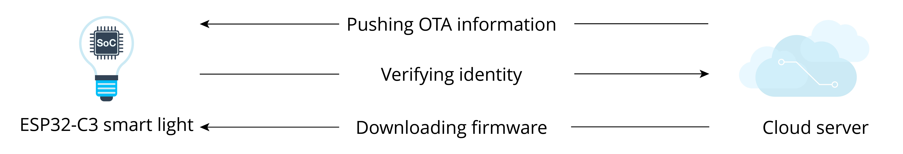

# Firmware Upgrade

The OTA mechanism allows the device to receive new firmware during normal operation, and write the new firmware to the currently inactive application partition. After verifying the validity of the firmware, the device switches to run on the new firmware. The basic steps of OTA are shown in Figure 11.1.

<figure align="center">
    
    <figcaption>Figure 11.1. Basic steps of OTA</figcaption>
</figure>

From Figure 11.1, the basic steps of OTA are as follows:

1.  The cloud server pushes OTA information to the device.

2.  The device verifies the identity of the cloud server and downloads
    the firmware from the trusted cloud server.

3.  The device decides whether to perform OTA according to the version
    information in the firmware. If it decides to perform OTA, the
    firmware is then requested and written to the flash. After the
    verification is successfully completed, the system switches to run
    on the new firmware.

According to the basic steps listed above, to put it simply, the OTA
process is the process of firmware acquisition, writing, verification,
and switching. Before further understanding the OTA mechanism, we will
first introduce the partition table and firmware startup process.
