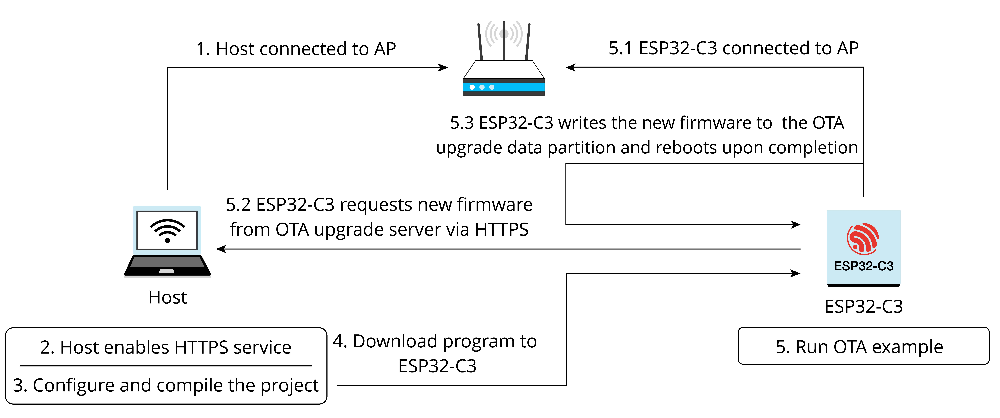

# Upgrade Firmware Through a Local Host

In the ESP-IDF example, the procedure of OTA is shown in Figure 11.4.

<figure align="center">
    
    <figcaption>Figure 11.4. Procedure of over-the-air (OTA)</figcaption>
</figure>

### 1. Enabling OTA server

Before running the OTA example, you need to first create the HTTPS
service and apply for a certificate. The certificate can be self-signed
by executing `openssl req -x509 -newkey rsa:2048 -keyout ca_key.pem -out ca_cert.pem -days 365 -nodes`. Logs are as follows:

```console
Generating a RSA private key 
. +++++
....................+++++
writing new private key to 'ca_key.pem'
-----
You are about to be asked to enter information that will be incorporated into your certificate request.
What you are about to enter is what is called a Distinguished Name or a DN.
There are quite a few fields but you can leave some blank
For some fields there will be a default value,
If you enter '.' , the field will be left blank.
-----
...
...
```

### 2. Enabling HTTPS service

The command `openssl s_server -WWW -key ca_key.pem -cert ca_cert.pem -port 8070` will enable an HTTPS service with port 8070 on the local
machine. The logs are as follows:

```console
...
Using default temp DH parameters
ACCEPT
...
...
```

Upon successful HTTPS connection, the logs are as follows:

```console
139783954665920:error:14094416:SSL routines:ssl3_read_bytes:sslv3 alert 
certificate unknown:../ssl/record/rec_layer_s3.c:1528:SSL alert number 46
FILE:advanced_https_ota.bin
...
...
```

### 3. Using the `esp_https_ota` component to perform OTA


Before the OTA test, let's first look at how to write an OTA program. The following sample code comes from [`esp-idf/examples/system/ota/advanced_https_ota/main/advanced_https_ota_example.c`](https://github.com/espressif/esp-idf/blob/master/examples/system/ota/advanced_https_ota/main/advanced_https_ota_example.c):

```c
void app_main(void)
{
    //Initialize NVS
    esp_err_t err = nvs_flash_init();
    if (err == ESP_ERR_NVS_NO_FREE_PAGES || err == ESP_ERR_NVS_NEW_VERSION_FOUND) {
        ESP_ERROR_CHECK(nvs_flash_erase());
        err = nvs_flash_init();
    }
    ESP_ERROR_CHECK( err );

    ESP_ERROR_CHECK(esp_netif_init());
    ESP_ERROR_CHECK(esp_event_loop_create_default());

    //Initialize connection
    ESP_ERROR_CHECK(example_connect());

    //firmware verification
    const esp_partition_t *running = esp_ota_get_running_partition();
    esp_ota_img_states_t ota_state;
    if (esp_ota_get_state_partition(running, &ota_state) == ESP_OK) {
        if (ota_state == ESP_OTA_IMG_PENDING_VERIFY) {
            if (esp_ota_mark_app_valid_cancel_rollback() == ESP_OK) {
                ESP_LOGI(TAG, "App is valid, rollback cancelled successfully");
            } else {
                ESP_LOGE(TAG, "Failed to cancel rollback");
            }
        }
    }

#if CONFIG_EXAMPLE_CONNECT_WIFI
    //Set PS mode
    esp_wifi_set_ps(WIFI_PS_NONE);
#endif 
    //Create Over-the-air (OTA) task
    xTaskCreate(&advanced_ota_example_task, "advanced_ota_example_task", 1024 * 8, NULL, 5, NULL);
}
```

The above code snippet demonstrates the following procedure:

1.  Initialise NVS with the `nvs_flash_init()` function, which is
    generally the first step in writing an ESP32-C3 application.

2.  Initialise the `netif` layer and connect to Wi-Fi with the
    `example_connect()` function. This function is generic and is
    realised in the `protocol_examples_common` component. You can
    replace it with your own Wi-Fi connection function.

3.  If rollback is enabled, then you need to set the firmware status.

4.  (Optional) Set the PS mode to `WIFI_PS_NONE` with the
    `esp_wifi_set_ps()` function to disable the power saving mode and
    achieve maximum data throughput.

5.  Create an OTA task and complete the firmware receiving process in
    the task. For proceduce of `advanced_ota_example_task`, please
    refer to Section 11.1.3.

With the basic understanding of the above example, we can now proceed to
the OTA test. Please perform and complete the following actions
successively:

1. Set the target chip to ESP32-C3 with the following command:

    <pre><code>$ <b>idf.py set-target esp32c3</b></code></pre>

2. Set Wi-Fi information.

    Run `idf.py menuconfig` and edit the Wi-Fi SSID and password as follows:

    ```console
    (Top) → Example Connection Configuration
        Espressif IoT Development Framework Configuration
    [*] connect using WiFi interface
    (Xiaomi_32BD) WiFi SSID
    (12345678) WiFi Password
    [ ] connect using Ethernet interface
    [*] Obtain IPv6 address
        Preferred IPv6 Type (Local Link Address)  --->
    ```

3. Set OTA information.

    Fill in `Firmware Upgrade` URL and select skipping server certificate CN fieldcheck and firmware version check.

    ```condole
    (https://192.168.31.177:8070/advanced_https_ota.bin) Firmware Upgrade URL
    [*] Skip server certificate CN fieldcheck
    [*] Skip firmware version check
    (5000) OTA Receive Timeout
    ```

4. Build firmware with the command `idf.py build`.

    After building, extract `advanced_https_ota.bin` under the `build` directory to the directory of the HTTPS server, namely, the directory where the `openssl s_server` operation is performed.

5. Download firmware.

    Run `idf.py flash monitor` to download the firmware and open monitor.

    Upon completion of all operations, ESP32-C3 will power up and connect to the set Wi-Fi and reboot after downloading the firmware from the set URL.
