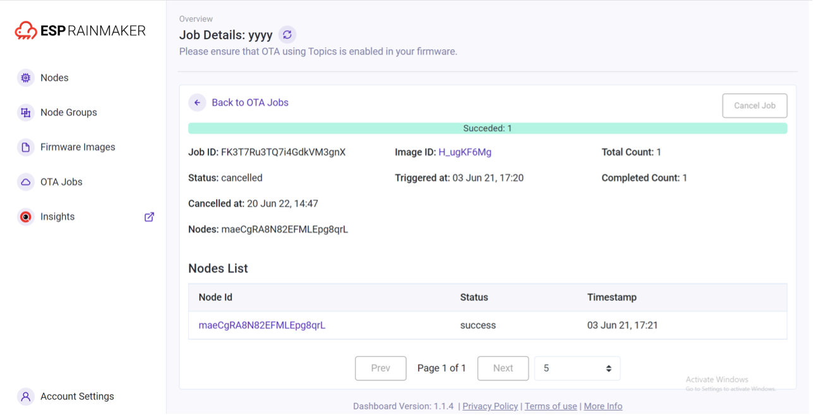

# Upgrade Firmware Through ESP RainMaker

A more common solution is to update firmware through a cloud platform.
In this section, we'll introduce how to push update messages from cloud
to the device with ESP RainMaker. ESP RainMaker uses `esp_https_ota`
component as well. With the code of OTA integrated in the ESP RainMaker
SDK, you can enable OTA by merely calling the `esp_rmaker_ota_enable()`
function. Note that while ESP RainMaker provides two ways of OTA, you
need to select receiving OTA messages using topics. By subscribing
topics related to OTA, you can receive MQTT messages, parse out the URL
of the firmware, and push the progress and final status of the current
update through these topics. The code for the ESP RainMaker OTA is
stored under the [`esp-rainmaker/components/esp_rainmaker/src/ota`](https://github.com/espressif/esp-rainmaker/tree/master/components/esp_rainmaker/src/ota) directory. The code related to firmware downloads is stored in the source file `esp_rmaker_ota.c` under the same directory, as well as the following code:

```c
//ESP RainMaker OTA status
char *esp_rmaker_ota_status_to_string(ota_status_t status)
{
    switch (status) {
        case OTA_STATUS_IN_PROGRESS:
        return "in-progress";
        case OTA_STATUS_SUCCESS:
        return "success";
        case OTA_STATUS_FAILED:
        return "failed";
        case OTA_STATUS_DELAYED:
        return "delayed";
        default:
        return "invalid";
    }
    return "invalid";
}

esp_err_t esp_rmaker_ota_report_status(esp_rmaker_ota_handle_t ota_handle,
                                      ota_status_t status, char *additional_info)
{
    ......
    if (ota->type == OTA_USING_PARAMS) {
        err = esp_rmaker_ota_report_status_using_params(ota_handle, status, additional_info);
    } else if (ota->type == OTA_USING_TOPICS) {
        err = esp_rmaker_ota_report_status_using_topics(ota_handle, status, additional_info);
    }
    ......
}
```

There are four OTA statuses in ESP RainMaker: firmware acquisition in progress (`OTA_STATUS_IN_PROGRESS`), OTA succeeded (`OTA_STATUS_SUCCESS`), OTA failed (`OTA_STATUS_FAILED`), and delayed (`OTA_STATUS_DELAYED`).

Firmware acquisition in progress corresponds to the status of
downloading firmware, which should be reported to the cloud platform
when the `esp_https_ota_begin()` function is called, and the cloud
platform will then update the icon correspondingly. OTA succeeded and
OTA failed indicate the results of firmware download and verification.
Delayed indicates that the device is currently not available to process
the request, and the OTA status can later be updated through the
`esp_rmaker_ota_report_status()` function.

```c
//Firmware information verification
static esp_err_t validate_image_header(esp_rmaker_ota_handle_t ota_handle, esp_app_desc_t *new_app_info)
{
    if (new_app_info == NULL) {
        return ESP_ERR_INVALID_ARG;
    }

    //Firmware status aquisition
    const esp_partition_t *running = esp_ota_get_running_partition();
    esp_app_desc_t running_app_info;
    if (esp_ota_get_partition_description(running, &running_app_info) == ESP_OK) {
        ESP_LOGD(TAG, "Running firmware version: %s",running_app_info.version);
    }

    //Verify project version number
#ifndef CONFIG_ESP_RMAKER_SKIP_VERSION_CHECK`
    if (memcmp(new_app_info->version, running_app_info.version, sizeof(new_app_info->version)) == 0){
        ESP_LOGW(TAG, "Current running version is same as the new. We will not continue the update." );
        esp_rmaker_ota_report_status(ota_handle, OTA_STATUS_FAILED, "Same version received");
        return ESP_FAIL;
    }
#endif

    //Verify project name
#ifndef CONFIG_ESP_RMAKER_SKIP_PROJECT_NAME_CHECK
    if (memcmp(new_app_info->project_name, running_app_info.project_name, sizeof(new_app_info->project_name)) ! =  0 ){
        ESP_LOGW(TAG, "OTA Image built for Project: %s. Expected: %s",
                new_app_info->project_name, running_app_info.project_name);
        esp_rmaker_ota_report_status(ota_handle, OTA_STATUS_FAILED, "Project Name mismatch");
        return ESP_FAIL;
    }
#endif
    return ESP_OK;
}
```

ESP RainMaker manages firmware by verifying the project version number
and the project name. Only when the new and old firmware of the same
project name are verified to have different project version numbers, the
firmware downloading will then be allowed to continue. Generally
speaking, the project version number is generally incremented, which is
more conducive for version control. By comparing project names, you can
prevent any accidental pushing of other products' firmware.

```c
static esp_err_t esp_rmaker_ota_default_cb(esp_rmaker_ota_handle_t ota_handle, esp_rmaker_ota_data_t *ota_data)
{
    ......
    //OTA http parameter configuration
    esp_err_t ota_finish_err = ESP_OK;
    esp_http_client_config_t config = {
        .url = ota_data->url,
        .cert_pem = ota_data->server_cert,
        .timeout_ms = 5000,
        .buffer_size = DEF_HTTP_RX_BUFFER_SIZE,
        .buffer_size_tx = buffer_size_tx
    };
#ifdef CONFIG_ESP_RMAKER_SKIP_COMMON_NAME_CHECK
    config.skip_cert_common_name_check = true;
#endif
    ......
    //Report update status
    esp_rmaker_ota_report_status(ota_handle, OTA_STATUS_IN_PROGRESS, "Starting OTA Upgrade");

    ...
    ...
    //Establish HTTPS connection and prepare to download firmware
    esp_err_t err = esp_https_ota_begin(&ota_config, &https_ota_handle);
    if (err ! = ESP_OK) {
        ESP_LOGE(TAG, "ESP HTTPS OTA Begin failed");
        esp_rmaker_ota_report_status(ota_handle, OTA_STATUS_FAILED, "ESP HTTPS OTA Begin failed");
        return ESP_FAIL;
    }
    ......
    //Aquire firmware information for verification
    esp_app_desc_t app_desc;
    err = esp_https_ota_get_img_desc(https_ota_handle, &app_desc);
    if (err ! = ESP_OK) {
        ESP_LOGE(TAG, "esp_https_ota_read_img_desc failed");
        esp_rmaker_ota_report_status(ota_handle, OTA_STATUS_FAILED, "Failed to read image decription");
        goto ota_end;
    }
    err = validate_image_header(ota_handle, &app_desc);
    if (err ! = ESP_OK) {
        ESP_LOGE(TAG, "image header verification failed");
        goto ota_end;
    }

    esp_rmaker_ota_report_status(ota_handle, OTA_STATUS_IN_PROGRESS, "Downloading Firmware Image");
    int count = 0;

    // Download firmware cyclically
    while (1) {
        err = esp_https_ota_perform(https_ota_handle);
        if (err ! = ESP_ERR_HTTPS_OTA_IN_PROGRESS) {
            break;
        }
    ......
    }

    // Release HTTPS resource after downloading and start verification
    ota_finish_err = esp_https_ota_finish(https_ota_handle);
    if ((err == ESP_OK) && (ota_finish_err == ESP_OK)) {
        //Report OTA succeeded status to cloud after successful verification
        ESP_LOGI(TAG, "OTA upgrade successful. Rebooting in %d seconds...", OTA_REBOOT_TIMER_SEC);
        esp_rmaker_ota_report_status(ota_handle, OTA_STATUS_SUCCESS, "OTA Upgrade finished successfully");
        esp_rmaker_reboot(OTA_REBOOT_TIMER_SEC);
        return ESP_OK;
    } 
    ......
}
```

The `esp_rmaker_ota_default_cb()` function is the default OTA callback
function in ESP RainMaker and will be called once an OTA message is
received from the cloud. The procedure of this function is similar to
that of the OTA example function introduced in Section 11.1.3. The
difference is that the `esp_rmaker_ota_default_cb()` function includes
the reporting of OTA status, which will update the current OTA progress
of the device to the cloud platform in time.

```c
esp_err_t esp_rmaker_ota_enable(esp_rmaker_ota_config_t *ota_config,
                                esp_rmaker_ota_type_t type)
{
    //Acquire partition information and verify firmware vadility through callback
    const esp_partition_t *running = esp_ota_get_running_partition();
    esp_ota_img_states_t ota_state;
    if (esp_ota_get_state_partition(running, &ota_state) == ESP_OK) {
        if (ota_state == ESP_OTA_IMG_PENDING_VERIFY) {
            ESP_LOGI(TAG, "First Boot after an OTA");
            //Run diagnostic function
            bool diagnostic_is_ok = true;
            if (ota_config->ota_diag) {
                diagnostic_is_ok = ota_config->ota_diag();
            }
            if (diagnostic_is_ok) {
                ESP_LOGI(TAG, "Diagnostics completed successfully! Continuing execution ...");
                esp_ota_mark_app_valid_cancel_rollback();
            } else {
                ESP_LOGE(TAG, "Diagnostics failed! Start rollback to the previous version ...");
                esp_ota_mark_app_invalid_rollback_and_reboot();
            }
        }
    }

    // Over-the-air (OTA) task callback function
    if (ota_config->ota_cb) {
        ota->ota_cb = ota_config->ota_cb;
    } else {
        ota->ota_cb = esp_rmaker_ota_default_cb;
    }
    ......
    return err;
}
```

The OTA part in ESP RainMaker encapsulates the self-test segment of the
rollback function. You can input a self-test function with a Boolean
return value through the `esp_rmaker_ota_config_t` structure. When calling the `esp_rmaker_ota_enable()` function to enable OTA, once the current firmware status is found to be pending for verification (`ESP_OTA_IMG_PENDING_VERIFY`), the self-test function input previously will be called by the function pointer, and the current firmware status will be set through the return value of the self-test function. `server_cert` in the `esp_rmaker_ota_config_t` structure points to the server-side certificate. ESP RainMaker uses AWS S3 bucket storage service, and you can pass in the certificate directly via the macro `ESP_RMAKER_OTA_DEFAULT_SERVER_CERT`, which is used during OTA to perform verifications and prevent DNS spoofing. You can upload the new firmware in the management backend of ESP RainMaker. The project version of the new firmware must be different from the version expected to be updated to, and there are two ways to modify the version in ESP
RainMaker:

1.  Modify the project version number introduced in Section 11.2.1.

2.  Modify the `CMakeLists.txt` file by adding `set(PROJECT_VER "1.0")`.
    You may refer to the example about this part.

Once the new firmware is built, you can upload the new firmware as shown
in Figure 11.5.

<figure align="center">
    
    <figcaption>Figure 11.5. Uploading new firmware</figcaption>
</figure>

Once the firmware is uploaded, you can enable the OTA task as shown in Figure 11.6. The procedure of booting the OTA task is as follows:

<figure align="center">
    
    <figcaption>Figure 11.6. Boot the OTA task</figcaption>
</figure>

1.  Select the firmware used for OTA from the list.

2.  Click "Start OTA" for the firmware.

3.  Fill in information of the OTA task and select the node to be
    updated. When the "Force Push" option is selected, online nodes can
    receive OTA messages immediately. Otherwise, nodes will obtain URLs
    for OTA based on the defined OTA policy (checks during startup,
    periodic checks, etc.), which may cause delays.

The OTA Job Monitor (see Figure 11.7) provides real-time feedback on the
status of OTA, including the information available to users and the
functions implemented.

<figure align="center">
    
    <figcaption>Figure 11.7. Interface of OTA Job Monitor</figcaption>
</figure>

-   After initiating OTA successfully, the OTA status can be checked in
    the task details of the current OTA job, which are reported by the
    device.

-   The OTA Job Monitor will provide an overview of the task and the
    status of each node can be checked.

-   The OTA task can be cancelled midway, but the nodes which have
    already obtained the URL will continue upgrading.
