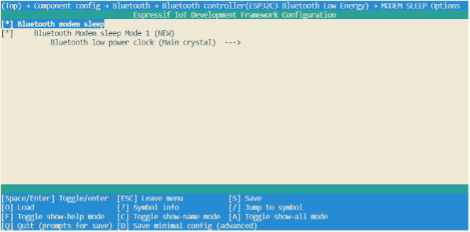

# Modem-sleep mode

Currently, Modem-sleep mode on ESP32-C3 is only applicable when Wi-Fi
Station connection and Bluetooth LE connection are active. The mode
takes effect after the Wi-Fi Station connection router and Bluetooth LE
are connected, and the chip periodically switches between Active mode
and Modem-sleep mode. In Modem-sleep mode, the baseband of Wi-Fi and
Bluetooth LE is clock gated or turned off. When the RF module is turned
off, ESP32-C3 can be automatically woken up without any delay (also,
this can be done without configuring any wakeup source). After waking up
from Modem-sleep mode, the chip's RF module switches from Modem-sleep
mode to Active mode, causing an increase in power consumption.

ESP32-C3 uses the Wi-Fi Delivery Traffic Indication Message (DTIM)
beacon mechanism to maintain a connection to the router. In Modem-sleep
mode, ESP32-C3 will power off the RF module between two DTIM beacons to
save power, and automatically wake up the RF module just before the next
DTIM beacon arrives. The duration of sleep is determined by the router's
DTIM beacon interval and the `listen_interval` parameter of ESP32-C3. In
Modem-sleep mode, ESP32-C3 remains connected to the Wi-Fi router, which
allows it to receive interactive information from a smartphone or server
through the router.

DTIM can usually indicate the frequency of data transmission when using
a router. Typically, the DTIM beacon interval of a router ranges from
100 to 1000 ms.

ESP32-C3 uses the Bluetooth LE Connection Event to maintain a connection
with the peer device. In Modem-sleep mode, ESP32-C3 will power off the
RF module between the two Connection Events to save power, and
automatically wakes up before the next Connection Event arrives, and the
duration of sleep is determined by the Bluetooth LE connection
parameters.

Modem-sleep mode is typically used in low-power applications where the
CPU is required to work constantly and a Wi-Fi or Bluetooth LE
connection must be maintained. For example, when using the ESP32-C3 in
local voice wakeup applications, the CPU constantly collects and
processes audio data.

## Wi-Fi Modem-sleep mode

In development, users can use `esp_wifi_set_ps()` function to set
current Wi-Fi power save `type`:

-   `WIFI_PS_NONE`: not using Modem-sleep mode.

-   `WIFI_PS_MIN_MODEM`: ESP32-C3 wakes up to receive beacon every
    router DTIM beacon, i.e. 1 router interval.

-   `WIFI_PS_MAX_MODEM`: ESP32-C3 wakes up periodically to receive
    beacon. The interval can be configured via the `listen_interval`
    parameter in `wifi_sta_config_t` (unit: in units of the interval
    time of the router DTIM beacon). The default value is 3, which
    indicates an interval of 3 router beacons. The code is as follows:

```c
typedef enum {
    WIFI_PS_NONE,        /*< No power save*/
    WIFI_PS_MIN_MODEM,   /*< Minimum modem power saving. In this mode, station wakes up to receive beacon every DTIM period*/
    WIFI_PS_MAX_MODEM,   /*< Maximum modem power saving. In this mode, interval to receive beacons is determined by the listen_interval parameter in wifi_sta_config_t*/
} wifi_ps_type_t;

esp_err_t esp_wifi_set_ps(wifi_ps_type_t type);
```

If `type` is configured as `WIFI_PS_MAX_MODEM`, configure the interval `listen_interval` that ESP32-C3 wakes up to receive beacon as follows:

```c
#define LISTEN_INTERVAL 3
wifi_config_t wifi_config = {
    .sta = {
        .ssid = "SSID",
        .password = "Password",
        .listen_interval = LISTEN_INTERVAL,
    },
};
ESP_ERROR_CHECK(esp_wifi_set_mode(WIFI_MODE_STA));
ESP_ERROR_CHECK(esp_wifi_set_config(ESP_IF_WIFI_STA, &wifi_config));
ESP_ERROR_CHECK(esp_wifi_start());

ESP_ERROR_CHECK(esp_wifi_set_ps(WIFI_PS_MAX_MODEM));
```

## Bluetooth LE Modem-sleep mode

To enable the Modem-sleep mode for Bluetooth LE, run `idf.py menuconfig` command to start the Espressif IoT Development Framework Configuration tool (hereinafter referred to as the configuration tool), then go to `Component config → Bluetooth → Bluetooth controller (ESP32C3 Bluetooth Low Energy) → MODEM SLEEP Options` and
enable `Bluetooth modem sleep`; Use the default configuration for
`Bluetooth Modem sleep Mode 1` and `Bluetooth low power clock`. The Modem-sleep mode of ESP32-C3 Bluetooth LE is shown in Figure 12.1.

<figure align="center">
    
    <figcaption>Figure 12.1. Modem-sleep mode of ESP32-C3 Bluetooth LE</figcaption>
</figure>
