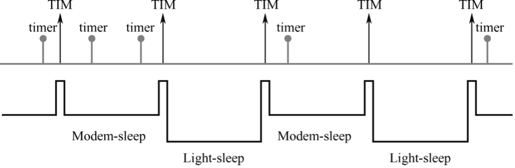
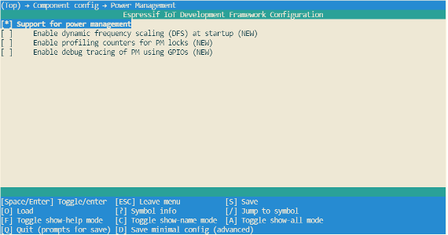
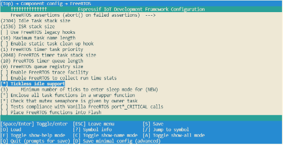

# Light-sleep Mode

Light-sleep mode functions in a similar manner to Modem-sleep mode, with
the exception that in Light-sleep mode, the ESP32-C3 will power down the
RF module and digital peripherals, while most of the RAM will be limited
by clock gating. Additionally, the CPU will be paused, resulting in
lower power consumption compared to Modem-sleep mode. After waking up
from Light-sleep mode, ESP32-C3's peripherals and CPU will resume
operation, and their internal state will be preserved. The wakeup
latency in Light-sleep mode is less than 1 ms. There are two ways to put
ESP32-C3 into Light-sleep mode:

### Entering Light-sleep mode manually

This is achieved by calling APIs. To enter Light-sleep mode manually, it
is necessary to configure Wi-Fi as a wakeup source to allow the device
to receive interactive information from either a smartphone or a server
through the router.

### Entering Light-sleep mode automatically

After being configured to automatically enter Light-sleep mode, ESP32-C3
will automatically enter Light-sleep mode when the CPU and RF module are
idle and can be automatically woken up to receive interactive
information from the smartphone or server through the router.

## Wakeup sources in Light-sleep mode

Manually entering Light-sleep mode requires configuring a wakeup source,
which can be set to timers, GPIOs, UART, Wi-Fi, or Bluetooth LE for
ESP32-C3. ESP32-C3 supports configuring one or more wakeup sources at
the same time, in which case ESP32-C3 will be woken up when either
wakeup source is triggered. Users can use `esp_sleep_enable_*_wakeup()`
function to configure wakeup sources, or use
`esp_sleep_disable_wakeup_source()` function to disable a wakeup source.
Before entering Light-sleep mode, users can configure the wake source at
any time. After waking up, users can determine which wakeup source was
responsible for waking up the chip by calling
`esp_sleep_get_wakeup_cause()` function. Available wakeup sources in
Light-sleep include:

### GPIO wakeup

Any GPIO can be used as the external input to wake up the chip from
Light-sleep mode. Each pin can be individually configured to trigger
wakeup on high or low level using the `gpio_wakeup_enable()` function.
GPIO wakeup can be used for any type of GPIO (RTC IO or digital IO).
Then the `esp_sleep_enable_gpio_wakeup()` function should be called to
enable this wakeup source.

### Timer wakeup

The RTC controller has a built-in timer which can be used to wake up the
chip after a predefined amount of time. Time is specified at microsecond
precision, but the actual resolution depends on the clock source
selected for the RTC `SLOW_CLK`. RTC peripherals or RTC memories don't
need to be powered on during sleep in this wakeup mode.
`esp_sleep_enable_timer_wakeup()` function can be used to enable sleep
wakeup using a timer.

### UART wakeup

When ESP32-C3 receives UART input from external devices, it is often
necessary to wake up the chip when input data is available. The UART
peripheral contains a feature which allows waking up the chip from
Light-sleep mode when a certain number of rising edges on RX pin are
seen. This number of rising edges can be set using
`uart_set_wakeup_threshold()`. Note that the character which triggers wakeup (and any
characters before it) will not be received by the UART after wakeup.
This means that the external device typically needs to send an extra
character to the ESP32-C3 to trigger wakeup before sending the data.
`esp_sleep_enable_uart_wakeup()` function can be used to enable this
wakeup source.

### Wi-Fi wakeup

When maintaining a Wi-Fi connection is required, the Wi-Fi can be
configured as a wake source to wake up ESP32-C3. The ESP32-C3 wakes up
before each DTIM beacon of the AP arrives and turns on its RF module,
thus maintaining a Wi-Fi connection. `esp_sleep_enable_wifi_wakeup()` function can be used to enable this wakeup source.

## Entering Light-sleep mode manually

To manually enter the Light-sleep mode, users can call corresponding
APIs to send ESP32-C3 into Light-sleep mode when needed. After entering
Light-sleep mode, ESP32-C3 will turn off the RF module and pause its
CPU. After waking up from Light-sleep mode, ESP32-C3 will continue to
execute the original program at the location where the Light-sleep API
was called. After manually entering the Light-sleep mode, ESP32-C3 can
maintain the connection to the router by enabling Wi-Fi as the wake
source and receive interactive information from the smartphone or server
through the router. However, if Wi-Fi is not enabled as a wake source,
ESP32-C3 may not receive packets in the network or disconnect the Wi-Fi
connection. The situation of enabling/disabling Bluetooth LE as a wake
source is similar.

> 📌 **Tip**
>
> - After calling the interface that manually send the chip into Light-sleep mode, ESP32-C3 will not immediately enter the Light-sleep mode, but will wait until the system is idle first.
>
> - With the Wi-Fi wakeup source enabled, only by entering the Light-sleep mode manually can ESP32-C3 maintain the connection with the router and receive the data sent in the network.

## Instructions on how to enter Light-sleep mode manually

After configuring the wakeup source, users can manually send the chip
into Light-sleep mode by calling `esp_light_sleep_start()` function. The
code is as follows:

```c
#define BUTTON_WAKEUP_LEVEL_DEFAULT 0
#define BUTTON_GPIO_NUM_DEFAULT     9

/*Configure the button GPIO as input, enable wakeup*/
const int button_gpio_num   = BUTTON_GPIO_NUM_DEFAULT;
const int wakeup_level      = BUTTON_WAKEUP_LEVEL_DEFAULT;
gpio_config_t config = {
    .pin_bit_mask   = BIT64(button_gpio_num),
    .mode           = GPIO_MODE_INPUT
};
ESP_ERROR_CHECK(gpio_config(&config));
gpio_wakeup_enable(button_gpio_num, wakeup_level == 0 ?
                   GPIO_INTR_LOW_LEVEL : GPIO_INTR_HIGH_LEVEL);

/*Wake up in 2 seconds, or when button is pressed*/
esp_sleep_enable_timer_wakeup(2000000);
esp_sleep_enable_gpio_wakeup();

/*Enter sleep mode*/
esp_light_sleep_start();
/*Execution continues here after wakeup*/
```

When no wakeup source is enabled, ESP32-C3 can still enter Light-sleep
mode. However, in this case, ESP32-C3 will remain in Light-sleep mode
until an external chip reset.

## Entering Light-sleep mode automatically

ESP32-C3 can be configured to automatically enter Light-sleep mode when
it is idle and does not need the RF module to work, and automatically
woken up when it needs to work (such as maintaining Wi-Fi and Bluetooth
LE connections or receiving data). In this case, users don't need to
send the chip into Light-sleep mode manually, nor configure the wakeup
source separately. After being configured to automatically enter
Light-sleep mode, ESP32-C3 can maintain the connection to the router and
receive interactive information from the smartphone or server through
the router, thus improving user experience. The Bluetooth LE connection
is similar to connecting to a router. Typically, automatic Light-sleep
mode is used in conjunction with Modem-sleep mode and power management.
When its RF module is not required, ESP32-C3 first enters Modem-sleep
mode. If it is idle at this time, ESP32-C3 will enter Light-sleep mode
to further reduce power consumption. The Modem-sleep mode of ESP32-C3 is
shown in Figure 12.2.

<figure align="center">
    
    <figcaption>Figure 12.2. Modem-sleep mode of ESP32-C3</figcaption>
</figure>

Automatic Light-sleep mode can be useful in scenarios that require
ESP32-C3 to maintain a connection with the router and respond to data
sent by the router in real time, but can be idle when no data needs to
be received. For example, in the application of a Wi-Fi smart switch,
the CPU remains idle most of the time until it receives a control
command. Only upon receiving this command, the CPU activates and
controls the switch to turn on or off.

## Instructions on how to enter Light-sleep mode automatically

To configure enable the automatic Light-sleep mode, users can call `esp_pm_configure()` function and set parameter `light_sleep_enable` to `true`. When this feature is enabled, note that `CONFIG_FREERTOS_USE_TICKLESS_IDLE` and `CONFIG_PM_ENABLE` options must also be configured.

To configure `CONFIG_PM_ENABLE` option, users can run `idf.py menuconfig` command to start the configuration tool, go to `Component config → Power Management`, then enable `Support for power management`. The configuration of the ESP32-C3 power management function is shown in Figure 12.3.

<figure align="center">
    
    <figcaption>Figure 12.3. ESP32-C3 power management configuration</figcaption>
</figure>

Users can enable the Dynamic Frequency Modulation (DFS) feature and configure the chip to automatically enter Light-sleep mode by calling `esp_pm_configure()` function. When using ESP32-C3, the corresponding parameter of this function is `esp_pm_config_esp32c3_t`, which is a structure that defines the relevant DFS settings and controls if the chip can automatically enter Light-sleep mode. In the above structure, the following three member variables (fields) need to be initialised:

-   `max_freq_mhz`: Maximum CPU frequency in MHz, i.e., the frequency
    used when `ESP_PM_CPU_FREQ_MAX` lock is acquired. This field is usually set to `CONFIG_ESP32C3_DEFAULT_CPU_FREQ_MHZ`.

-   `min_freq_mhz`: Minimum CPU frequency in MHz, i.e., the frequency
    used when only the `ESP_PM_APB_FREQ_MAX` lock is acquired. This
    field can be set to the XTAL frequency value, or the XTAL frequency
    divided by an integer. Note that 10 MHz is the lowest frequency at
    which the default `REF_TICK` clock of 1 MHz can be generated.

-   `light_sleep_enable`: Whether ESP32-C3 should automatically enter
    Light-sleep mode when no locks are acquired (`true`/`false`).

Automatic Light-sleep mode is based on FreeRTOS Tickless Idle functionality. If Automatic Light-sleep mode is requested while the option `CONFIG_FREERTOS_USE_TICKLESS_IDLE` is not enabled in `menuconfig`, `esp_pm_configure()` will return the error `ESP_ERR_NOT_SUPPORTED`. Configuration of ESP32-C3's FreeRTOS Tickless Idle feature is shown in Figure 12.4.

<figure align="center">
    
    <figcaption>Figure 12.4. Configuration of ESP32-C3's FreeRTOS Tickless Idle feature</figcaption>
</figure>

```c
#if CONFIG_PM_ENABLE
    //Configure dynamic frequency scaling:
    //automatic light sleep is enabled if tickless idle support is enabled.
    esp_pm_config_ESP32-C3_t pm_config = {
        .max_freq_mhz = 160, //Maximum CPU frequency
        .min_freq_mhz = 10,  //Minimum CPU frequency
#if CONFIG_FREERTOS_USE_TICKLESS_IDLE
        .light_sleep_enable = true
#endif
    };
    ESP_ERROR_CHECK( esp_pm_configure(&pm_config) );
#endif //CONFIG_PM_ENABLE
```
