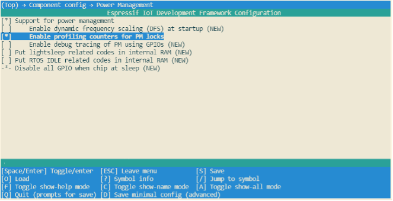

# Log Debugging

When using the log debugging feature, users need to configure
`CONFIG_PM_PROFILING` in `menuconfig` to track the retention time of
each power management lock, then call `esp_pm_dump_locks (FILE* stream)`
function to print such log. Log debugging allows users to analyse which
power management locks are preventing the chip from entering a low-power
mode and check how much time the chip spends in each power mode. After
debugging, users must disable `CONFIG_PM_PROFILING` in `menuconfig`.

To configure `CONFIG_PM_PROFILING`, users need to run
`idf.py menuconfig` command to start the configuration tool, go to
`Component config → Power Management`, and enable
`Enable profiling counters for PM locks`. The screenshot of how to
enable the log debugging for ESP32-C3 is shown in Figure 12.5.

<figure align="center">
    
    <figcaption>Figure 12.5. Configuration of ESP32-C3's low-power log debugging</figcaption>
</figure>

When ESP32-C3 is configured to automatically enter Light-sleep mode,
users must call `esp_pm_dump_locks (FILE* stream)` function periodically
to print debugging log and analyse the root cause of increased power
consumption. Some log debugging information is provided below:

```console
Time: 11879660
Lock stats:
name              type            arg  cnt     times      time      percentage
wifi              APB_FREQ_MAX    0    0        107       1826662   16%
bt                APB_FREQ_MAX    0    1        126       5367607   46%
rtos0             CPU_FREQ_MAX    0    1       8185       809685    7%
Mode stats:
name     HZ        time     percentage
SLEEP     40M      4252037  35%
APB_MIN   40M            0   0%
APB_MAX   80M      6303881  53%
CPU_MAX  160M       823595   6%
```

The `esp_pm_dump_locks (FILE* stream)` function prints two types of
debugging information, namely the `Lock stats` and `Mode stats`. The
Lock stats section lists the real-time status of all power management
locks used by the application with the following information: Name
(`name`), type of power management lock (`type`), parameter (`arg`),
number of times the power management lock is currently acquired (`cnt`),
total number of times the power management lock is acquired (`times`),
total amount of time the power management lock is acquired (`time`), and
the proportion of time when the power management lock is acquired
(`percentage`). The Mode stats section lists the real-time status of the
application's different modes with the following information: Mode name
(`name`), clock frequency (`HZ`), total amount of time in the mode
(`time`), and percentage of the amount of time in the mode
(`percentage`).

By checking the example log above, users can easily find out that, for
the `Wi-Fi` power management lock `APB_FREQ_MAX`,

-   this lock is currently not acquired,
-   the total amount time when this lock was acquired is 1826662 μs,
-   the total number of this lock being acquired is 107 times,
-   and the proportion of time when this lock was acquired is 16%.

Similarly, users can also know the `rtos0` power management lock `CPU_FREQ_MAX`:

-   is currently being acquired,
-   the total amount time when this lock was acquired is 809685 μs,
-   the total number of this lock being acquired is 8185 times,
-   and the proportion of time when this lock was acquired is 7%.

Also, users can read log information about the Mode stats in a similar
way. For example, in Sleep mode the clock frequency is 40 MHz, and the
total time in this mode is 4252037 μs, accounting for 35% of the
whole time. Similarly, users can read the log for other locks and states
themselves.
