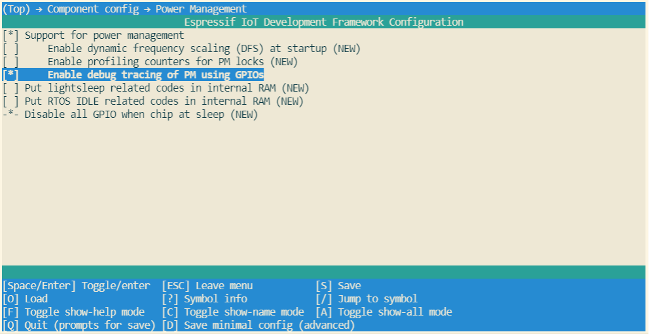

# GPIO Debugging

When using GPIO debugging, users need to go to `menuconfig`, and enable
`CONFIG_PM_TRACE`. If enabled, some GPIOs will be used to signal
events such as RTOS ticks, frequency switching, entry/exit from idle
state. For a list of GPIOs, see `pm_trace.c` file. This feature is
intended to be used when analysing/debugging behavior of power
management implementation and should be kept disabled after the
debugging.

The relevant GPIOs are shown below, with two GPIOs for each event,
corresponding to CPU0 and CPU1. Since ESP32-C3 is a single-core chip,
only the first column of GPIOs is effective when debugging. During
development, users can also modify the GPIO used by modifying the source
code. Before debugging, connect the selected GPIO to an instrument such
as a logic analyser or oscilloscope.

```c
/*GPIOs to use for tracing of esp_pm events.
* Two entries in the array for each type, one for each CPU.
* Feel free to change when debugging.
*/
static const int DRAM_ATTR s_trace_io[] = {
#ifndef CONFIG_IDF_TARGET_ESP32C3
    BIT(4),  BIT(5),        //ESP_PM_TRACE_IDLE
    BIT(16), BIT(17),       //ESP_PM_TRACE_TICK
    BIT(18), BIT(18),       //ESP_PM_TRACE_FREQ_SWITCH
    BIT(19), BIT(19),       //ESP_PM_TRACE_CCOMPARE_UPDATE
    BIT(25), BIT(26),       //ESP_PM_TRACE_ISR_HOOK
    BIT(27), BIT(27),       //ESP_PM_TRACE_SLEEP
#else
    BIT(2),  BIT(3),        //ESP_PM_TRACE_IDLE
    BIT(4),  BIT(5),        //ESP_PM_TRACE_TICK
    BIT(6),  BIT(6),        //ESP_PM_TRACE_FREQ_SWITCH
    BIT(7),  BIT(7),        //ESP_PM_TRACE_CCOMPARE_UPDATE
    BIT(8),  BIT(9),        //ESP_PM_TRACE_ISR_HOOK
    BIT(18), BIT(18),       //ESP_PM_TRACE_SLEEP
#endif
};
```

To enable `CONFIG_PM_PROFILING`, users need to run the
`idf.py menuconfig` command to start the configuration tool, go to
`Component config → Power Management`, and enable
`Enable debug tracing of PM using GPIOs`. The screenshot of how to
Enable debug tracing of PM using GPIOs for ESP32-C3 is shown in Figure
12.6.

<figure align="center">
    
    <figcaption>Figure 12.6. ESP32-C3 low-power GPIO debug configuration</figcaption>
</figure>

The debugging can begin after completing the above-mentioned
configuration. By observing different GPIO states, users get to know the
current state of the CPU and the corresponding power mode, and further
understand which power modes consume more power and can be optimised.
Figure 12.7 shows the waveform of ESP32-C3's GPIO debugging for reduced
power consumption. The upper section shows the real-time power
consumption of ESP32-C3, and the lower section shows the GPIO waveform
corresponding to `ESP_PM_TRACE_SLEEP` event.

<figure align="center">
    
    <figcaption>Figure 12.7. ESP32-C3 low-power GPIO debug waveform</figcaption>
</figure>
