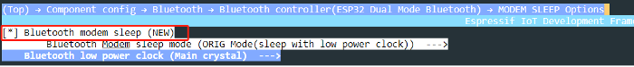

# Configuring Power Management Feature

### 1. Enable the power management feature and Automatic Light-sleep mode.

When enabling the power management feature, users first need to enable
the corresponding options in `menuconfig`, then call
`esp_pm_configure()` function (Please select `esp_pm_config_esp32c3_t` when you are developing with ESP32-C3). For instructions on how to enable the Automatic Light-sleep mode, please
check Section 12.2.2.

### 2. Configure `Wi-Fi Modem-sleep & Bluetooth Modem-sleep`.

-   To enable `Bluetooth Modem-sleep mode`, just enable the option in
    `menuconfig` shown in the screenshot below.

    <figure align="center">
        
        <figcaption>Figure 12.8. ESP32-C3's <code>Bluetooth LE Modem-sleep</code> configuration</figcaption>
    </figure>

-   To enable Wi-Fi modem-sleep mode, users need to first initialise
    Wi-Fi, and then call `esp_wifi_set_ps(wifi_ps_type_t type)`
    function. The code to enable Wi-Fi modem-sleep mode for the Smart
    Light project is as follows:

    ```c
    #define LISTEN_INTERVAL 3
    wifi_config_t wifi_config = {
        .sta = {
            .ssid = "SSID",
            .password = "Password",
            .listen_interval = LISTEN_INTERVAL,
        },
    };
    ESP_ERROR_CHECK(esp_wifi_set_mode(WIFI_MODE_STA));
    ESP_ERROR_CHECK(esp_wifi_set_config(ESP_IF_WIFI_STA, &wifi_config));
    ESP_ERROR_CHECK(esp_wifi_start());
    
    ESP_ERROR_CHECK(esp_wifi_set_ps(WIFI_PS_MAX_MODEM));
    ```
