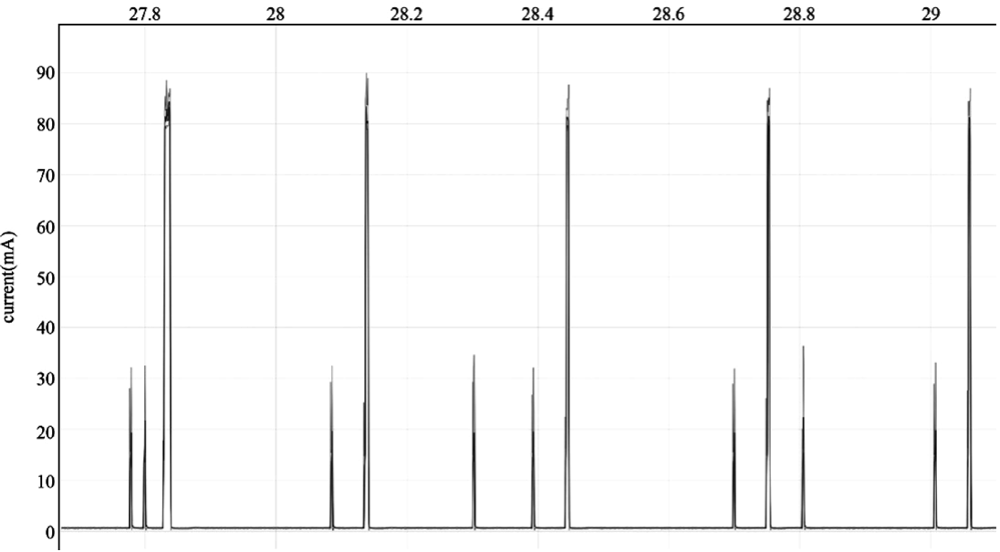

# Verifying Power Consumption

<figure align="center">
    
    <figcaption>Figure 12.9. Average current of ESP32-C3 module</figcaption>
</figure>

After completing all the above-mentioned configuration to reduce power
consumption, it's time to test the actual power consumption and check if
it meets the power consumption requirements. According to the
certification requirements, the actual DUT can be the whole light
product or just the ESP32-C3 module. When the ESP32-C3 module is
selected as the DUT, a power analyser can be added between the DC power
supply and the chip to measure the power consumption data. The power
analyser used in this book is Joulescope: Precision DC Energy Analyser.
Among the certification requirements related to power consumption, it is
often necessary for smart lighting devices to measure the average
current when the lights are off and Wi-Fi is connected.

After implementing the power management scheme introduced above, the
average current of the ESP32-C3 module is 2.24 mA (see Figure 12.9).
Note that the actual test result may be different because Figure 12.9
only shows the power consumption of ESP32-C3 module for a short period
of time.
