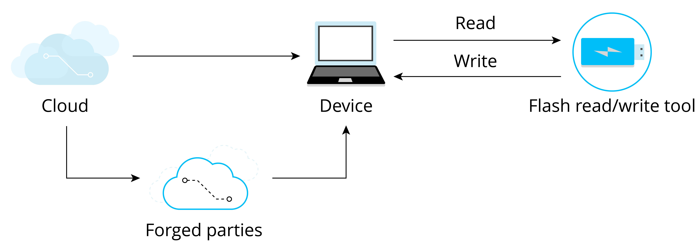

# Why Securing IoT Device Data?

IoT device data may be exposed to varying security threats during
transmission and storage stages. Figure 13.1 shows data exchange between
the device and the cloud, where the cloud sends data to the device, and
the device receives and stores the data in its flash memory. To ensure
data security and compliance with confidentiality, integrity, and
legitimacy, encrypted HTTPS protocol is commonly used for data
transmission. However, there is still a possibility that malicious
actors could compromise data security by potentially engaging in the
following actions:

-   Compromising data **confidentiality**, such as using `esptool.py` to
    read the data in the flash and steal the device ID and Wi-Fi
    password.

-   Compromising data **integrity**, such as erasing user login data
    from the device's flash, tampering with network certificates, or
    implanting programs that collect user information. This kind of
    attack which embeds malicious code into a source code is called code
    injection attack.

-   Compromising data **legitimacy**, such as forging the cloud server
    and sending illegal data to the device, or eavesdropping on a secure
    network communication, and then resending the login information to
    the device to log in and control device. The attack that undermines
    the data legitimacy by "replaying" stolen data is called a replay
    attack.

Figure 13.1 shows the security risks that the device may face when
exchanging data with the cloud.

<figure align="center">
    
    <figcaption>Figure 13.1. Security risks when exchanging data with cloud</figcaption>
</figure>

As we can see, device data security cannot be guaranteed unless proper
measures are taken. In real-world applications, threats to IoT devices
are much more complex than those discussed above. As IoT devices often
communicate with other devices and some may operate in unattended
environments, it becomes easier for malicious actors to obtain, analyse,
or tamper with the device's data. Therefore, ensuring data security has
become a more urgent requirement.
