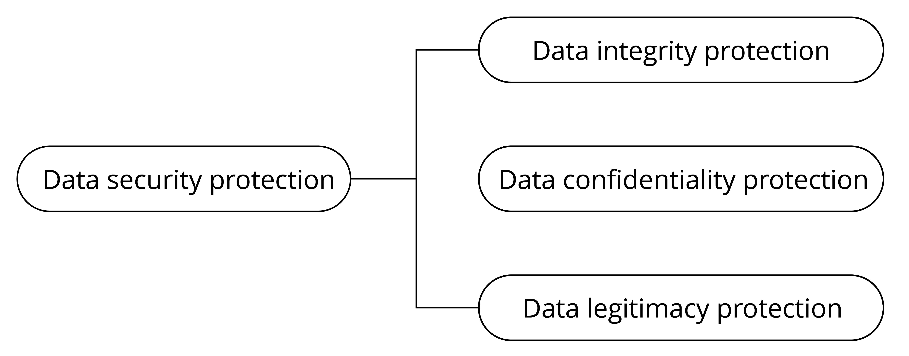

# Basic Requirements for IoT Device Data Security

Protecting the data security of IoT devices needs to be discussed from
two aspects: data storage and data transmission. They respectively
propose requirements for the protection of data integrity,
confidentiality, and legality. The basic components of data security are
shown in Figure 13.2.

<figure align="center">
    
    <figcaption>Figure 13.2. Basic components of data security</figcaption>
</figure>

The requirements for data transmission security mainly include the
following three aspects:

-   Integrity: Data should not be tampered with or contain errors during
    transmission.
-   Confidentiality: The data being transmitted is encrypted, and
    attackers cannot access the real content of the data.
-   Legitimacy: The communicating peer device is a trusted target
    device.

The requirements for data storage security also include three aspects:

-   Integrity: Data should not be tampered with or damaged during
    storage.
-   Confidentiality: After the stored data is read, attackers cannot
    decipher the real content of the data.
-   Legitimacy: The data being used is authenticated.

Of course, data storage security and transmission security are not
completely independent. They complement each other and together
constitute a unified framework for the security of IoT device data.
After establishing the above framework, clarifying some concepts, and
providing an understanding of the requirements for IoT device data
security, this chapter will further explain how to protect IoT device
data step by step.
