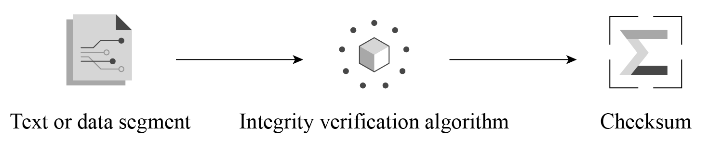
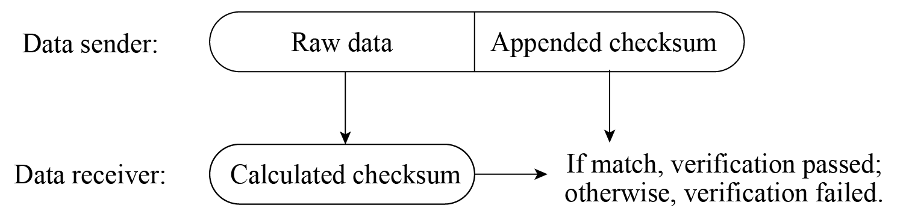

# Introduction to Integrity Verification Method

To verify data integrity, a block of data called checksum (also known as
digest, fingerprint, hash value, or hash code) is usually used. The
checksum is fixed-length check data generated by the corresponding
integrity verification algorithm. The checksum essentially represents
the uniqueness of the data block, just like a person's fingerprint or ID
number can uniquely represent this person. The integrity check algorithm
is shown in Figure 13.3.

<figure align="center">
    
    <figcaption>Figure 13.3. Integrity verification algorithm</figcaption>
</figure>

The integrity verification algorithm has the following properties:

### Collision resistance

Collision resistance means that within the data length specified by the
algorithm, it is not feasible (or very difficult) to find two different
data segments x and y that result in the same checksum. A collision
happens when the size of data increases, some data is lost or damaged,
but the correct checksum can be calculated.

### Raw data cannot be derived

In the case where the checksum is known, it is hard to figure out from
the checksum what the raw data is.

  
A collision occurs when different pieces of data are input into the
algorithm, resulting in the same checksum. Common integrity verification
algorithms include CRC, MD5, SHA1, and SHA256. These algorithms generate
checksums of varying lengths, which affects the likelihood of a
collision. For example, the CRC32 checksum has a length of 32 bytes and
can theoretically guarantee that data within 512 MB will not collide.
However, the probability of data collision increases beyond this range.

A common way to perform data integrity verification is to append a
checksum to the data to be verified. Figure 13.4 illustrates the basic
principle of integrity verification, where a checksum is appended to the
end of the data block. Upon receiving the data block, or prior to using
the data, the receiver recalculates the checksum. If the calculated
checksum matches the appended checksum, the data is deemed to be
integral, otherwise the data is deemed to have been tampered with or to
contain code errors.

<figure align="center">
    
    <figcaption>Figure 13.4. Basic principle of data integrity verification</figcaption>
</figure>
