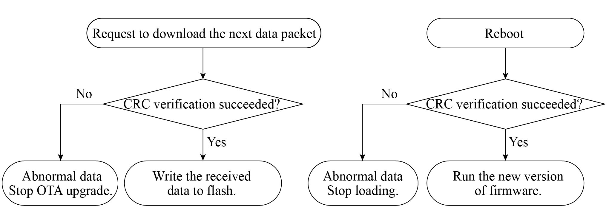

# Integrity Verification of Firmware Data

This section takes the integrity verification of firmware data during
OTA upgrades as an example to introduce how data integrity verification
is designed. Figure 13.5 shows that during firmware updates, integrity
verification is performed before data transmission and updated firmware
loading.

<figure align="center">
    
    <figcaption>Figure 13.5. Integrity verification before data transmission and firmware loading</figcaption>
</figure>

In the process of OTA upgrades, if HTTPS protocol is used to transmit
data, the sender generates a CRC checksum for the data before
transmission, and the receiver recalculates a CRC checksum from the
received data, followed by verification similar to the process shown in
Figure 13.4. It is worth noting that when using the HTTPS protocol to
transmit data, there is no need to worry about CRC verification, as the
HTTPS protocol automatically performs this verification internally.

In addition, when the device uses the firmware stored in flash, it also
checks the integrity of the firmware. Every time the device is restarted
to load the app firmware, it will perform integrity verification to
ensure that the app firmware for loading is not damaged. This process
occurs automatically and does not need manual intervention.

However, it is far from enough to rely only on integrity verification
for ensuring data security. Since the mechanisms and implementations of
the integrity verification algorithms are usually open-source, malicious
attackers can use the same CRC verification algorithm to add a CRC
checksum to a custom firmware and flash it into the device's flash,
thereby passing the CRC check. To prevent such attacks, it is necessary
to identify the source of the data, which involves the data legitimacy
protection scheme &ndash; Secure Boot, which will be covered in detail in
Section 13.4.2.
