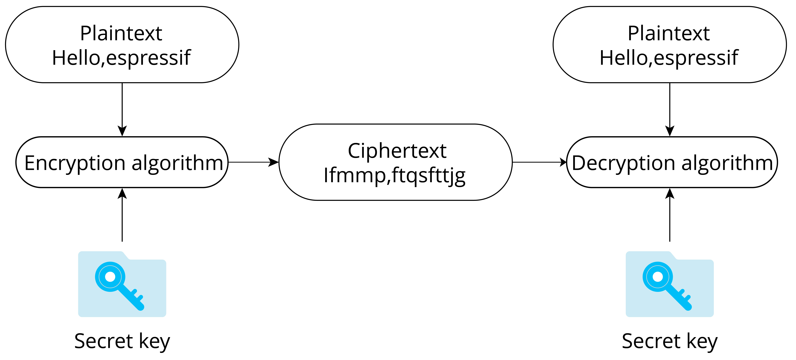
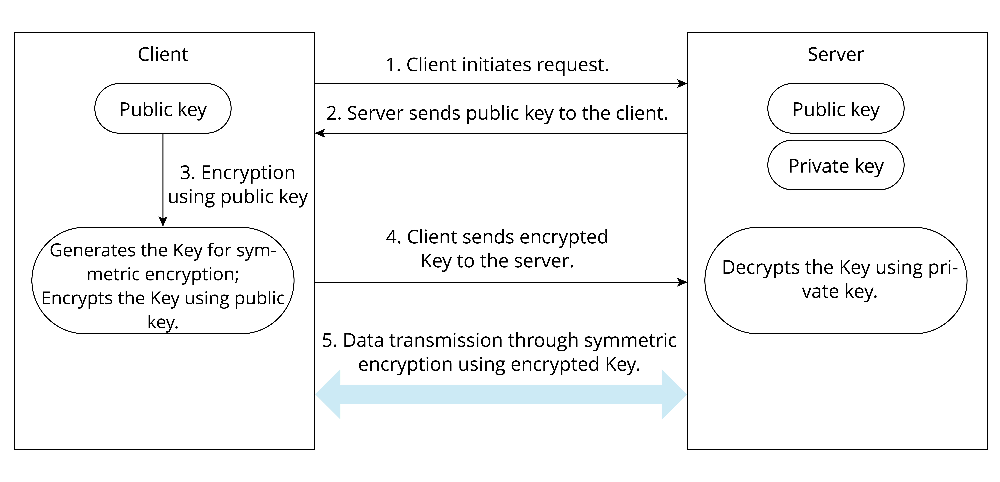

# Introduction to Data Encryption

The purpose of data encryption is to prevent unauthorised entities from
knowing the true meaning of the data, while enabling authorised users to
interpret the data correctly. Now, suppose you wish to encrypt the data
stored in the flash memory to prevent unauthorised access. First, you
need to understand the key concepts as shown in Figure 13.6. The
original data stored in flash is referred to as plaintext, while the
encrypted data generated by the encryption algorithm is known as
ciphertext. This ciphertext is incomprehensible to unauthorised
entities. The encryption algorithm utilises a key, which is a string of
numbers or characters. In the example presented in Figure 13.6, the
encryption algorithm adds 1 to (the ASCII code of) each character in the
original string and replaces all the characters. The key used by the
encryption algorithm is an integer number 1. The decryption process is
the reverse of the encryption process, where each character is changed
by subtracting 1, thereby recovering the plaintext.

All data encryption algorithms are based on the principle of replacing
one set of data with another. Figure 13.6 uses the simplest single-code
replacement encryption algorithm. In real applications, encryption
algorithms are much more complex, but the principle is the same.

<figure align="center">
    
    <figcaption>Figure 13.6. Basic principle of data encryption</figcaption>
</figure>

Data encryption algorithms can generally be divided into two categories:
symmetric encryption algorithms and asymmetric encryption algorithms.

## Symmetric encryption algorithms

As the name implies, symmetric encryption algorithms use the same key in
both encryption and decryption process. Commonly used symmetric
encryption algorithms include DES, 3DES, and AES. The encryption process
shown in Figure 13.6 is the basic process of symmetric encryption. The
key used for encryption and decryption is the same, that is, the integer
number 1.

## Asymmetric encryption algorithms

The asymmetric encryption algorithms use two different keys: public key
and private key, which are a pair of strings with a specific
association. The content encrypted by the public key can only be
decrypted by the paired private key. Similarly, the content encrypted by
the private key can only be decrypted by the paired public key.

  
A prerequisite for symmetric encryption is that the encryptor and the
decryptor must agree on a shared key, that is, they must know the
content of the key beforehand. However, in some cases, the encryptor and
decryptor have never met, nor exchanged data through any means other
than the network. In such cases without pre-agreed keys, how can the
encryptor and decryptor perform encryption or decryption? The answer is
asymmetric encryption algorithm.

Figure 13.7 shows the basic process of using asymmetric encryption and
symmetric encryption together to transmit encrypted data, where
asymmetric encryption is used to exchange the key used for encryption,
and after getting the symmetric key, the client and server use the less
resource-intensive symmetric encryption algorithm to protect the
confidentiality of transmitted data.

<figure align="center">
    
    <figcaption>Figure 13.7. Combining asymmetric and symmetric encryption to transmit data</figcaption>
</figure>

The commonly-used asymmetric encryption algorithm is RSA algorithm.

Technical details about encryption algorithms will not be provided in
this book. After gaining a foundational understanding of data
encryption, we can proceed to a new journey.
