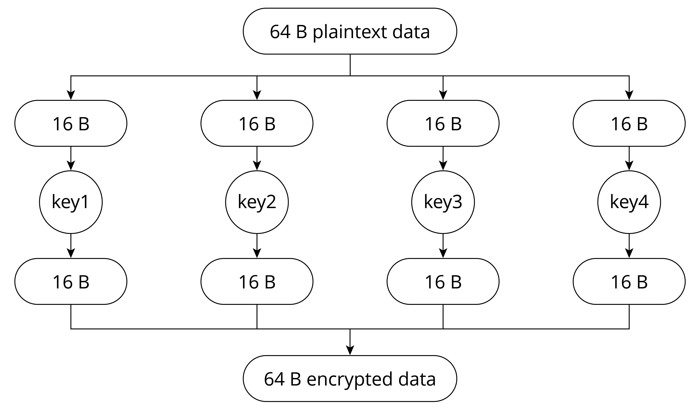

# Introduction to Flash Encryption Scheme

Flash encryption is used to enhance the protection of data
confidentiality so as to ensure data security. Once this feature is
enabled, physical readout of flash will not be sufficient to recover
flash contents. As explained above, data confidentiality needs to be
protected during both transmission and storage stages. Flash encryption
can be used to encrypt data stored in flash, while other encryption
scheme is needed for data transmission, for example HTTPS transmission
protocol.

## Relevant storage areas

Both eFuse and flash are storage media relevant to the flash encryption scheme, but have different properties and usages, as shown in Table 13.1.

<p align="center"><i>Table 13.1. Contents and properties of eFuse and flash</i></p>

|Storage medium|Contents|Properties|
|:------------:|--------|----------|
|Flash|`Bootloader.bin`, `app.bin`,`nvs` data, and partition tables|Flash memory can be erased and reprogrammed repeatedly.|
|eFuse|System parameters such as chip version and MAC, and keys and control bits relevant to system functions|Once an eFuse bit is programmed to 1, it can never be reverted to 0. In particular, for some eFuse blocks, if they are set to be read-protected, the data in these blocks can only be read by hardware cryptography modules.|

The types of data that are stored in the flash and encrypted by flash
encryption include firmware bootloader, app firmware, partition table,
and any partition marked with the `encrypted` flag in the partition
table.

Taking the following partition table as an illustration, enabling flash
encryption will result in the encryption of specific partitions, namely
the bootloader partition, factory partition, storage partition, and
nvs_key partition. Notably, partitions used to store firmware, such as
the bootloader partition and factory partition, are encrypted by
default, so there is no need to add `encrypted` flag to them.

```
# Name,     Type,   SubType,    Offset, Size,   Flags
nvs,        data,   nvs,        ,       0x6000,
# Extra partition to demonstrate reading/writing of encrypted flash
storage,    data,   0xff,       ,       0x1000, encrypted
factory,    app,    factory,    ,       1M,
# nvs_key partition contains the key that encrypts the NVS partition named nvs. The nvs_key partition needs to be encrypted.
nvs_key,    data,   nvs_keys,   ,       0x1000, encrypted,
```

Flash encryption is used to encrypt data stored in flash. Some eFuses
are used during flash encryption. The list of utilised eFuses and their
descriptions are given in Table 13.2.

<p align="center"><i>Table 13.2. eFuses used in flash encryption</i></p>

|eFuses|Description|Length (bit)|
|------|-----------|:----------:|
|<code>BLOCK_KEY<i>N</i></code>|<div style="width:350px">Used to store flash encryption/decryption key. *N* ranges from 0 to 4.</div>|256|
|`DIS_DOWNLOAD_MANUAL_ENCRYPT`|If set, disables flash encryption download function in download boot mode.|1|
|`SPI_BOOT_CRYPT_CNT`|Enables encryption and decryption. Feature is enabled if one or three bits are set in the eFuse, disabled otherwise.|3|

The tool `espefuse.py` can be used to check the current eFuse status on
ESP32-C3. For example, run the following command to check the current
eFuse value:

<pre><code>$ <b>espefuse.py --port PORT summary</b> //replace "PORT" with your port name</code></pre>

If `FLASH_CRYPT_CNT` is 0, as shown in the log below, it means flash
encryption is not enabled.

```console
espefuse.py v2.6-beta1
Connecting........_____.
EFUSE_NAME          Description = [Meaningful Value] [Readable/Writeable] (Hex  Value)
--------------------------------------------------------------------------------------
Security fuses:
FLASH_CRYPT_CNT        Flash encryption mode counter            = 0 R/W (0x0)
FLASH_CRYPT_CONFIG     Flash encryption config (key tweak bits) = 0 R/W (0x0)
CONSOLE_DEBUG_DISABLE  Disable ROM BASIC interpreter fallback   = 1 R/W (0x1)

Identity fuses:
MAC                   MAC Address                                       
    = 30:ae:a4:c3:86:94 (CRC 99 OK) R/W 
...
```

## Flash encryption algorithm

The symmetric encryption algorithm used by flash encryption is AES-XTS,
which is a tweakable block cipher. During encryption, the algorithm
encrypts plaintext data in blocks, and dynamically adjusts the key
according to the offset address of the plaintext data. The basic
principle of AES-XTS-128 block encryption is shown in Figure 13.8, where
the plaintext data of 64 Bytes are divided into four blocks, and the
encryption keys (key1 ~ key4) are derived from `base_key`.
Combining the four encrypted blocks will get the 64 B encrypted data.

<figure align="center">
    
    <figcaption>Figure 13.8. Basic principle of AES-XTS-128 block encryption</figcaption>
</figure>

The benefits of AES-XTS, which first dynamically adjusts the encryption
key and then encrypts data, are:

-   Encrypting the same data block results in different ciphertext,
    which makes the encrypted data more difficult to be analysed and
    cracked, thus increasing data confidentiality.

-   Different data blocks can be encrypted and decrypted independently.
    Even if one data block is damaged, it will not affect the decryption
    of other data blocks. Encryption/decryption between data blocks is
    independent.
