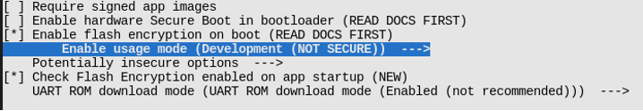

# Working Mode of Flash Encryption

Flash encryption has two working modes:

## Development mode

As the name suggests, development mode is used during the development
stage where there is a frequent need to program different plaintext
flash images and test the flash encryption process. This requires that
new plaintext images can be loaded as many times as needed. In
development mode, flash encryption can be disabled and new firmware can
be flashed using commands, which will be explained in Section 13.3.7.

## Release mode

Release mode is recommended for mass production. In release mode, serial
port cannot perform flash encryption operations, which can be ensured by
enabling flash encryption feature. In this mode, flash encryption cannot
be disabled once enabled, and new firmware cannot be downloaded over
serial port but only be downloaded using the over-the-air (OTA) scheme.

  
The working mode of flash encryption can be selected through `menuconfig → security features → Enable flash encryption on boot → Enable usage mode`. Figure 13.9 shows that development mode is enabled for flash encryption.

<figure align="center">
    
    <figcaption>Figure 13.9. Development mode enabled for flash encryption</figcaption>
</figure>

Note that in development mode, flash encryption can be disabled with `espefuse.py --port PORT burn_efuse SPI_BOOT_CRYPT_CNT`. After disabling encryption scheme, deselect the option in `menuconfig`, then run `idf.py flash` to flash new firmware. The number of times to disable flash encryption is limited by the length of the `SPI_BOOT_CRYPT_CNT` flag in eFuse. If the flag contains an odd number of "1"s, it means that flash encryption is enabled; if it contains an even number of "1"s, it means that flash encryption is disabled. If the length of the flag bit is 3 bits, it means flash encryption can only be disabled once.

> 📌 **Tip**
>
> Visit <https://docs.espressif.com/projects/esptool/en/latest/esp32/espsecure/index.html> for more information about `espefuse.py`.

Enabling flash encryption may increase the size of bootloader. Options
to work around this are:

1.  Set partition table offset through `menucofig → Partition Table → Offset of partition table`. For example, changing the offset from 0x8000 to 0xa000 will increase the space by 8 KB.

    Note that after changing the partition offset of the bootloader, you
    need to check whether the area allocation in the partition table
    needs to be updated.

2.  Reduce bootloader log level through `menuconfig → Bootloader log verbosity`. Changing log level from Info to Warning can reduce log size, thus reducing the bootloader size.
