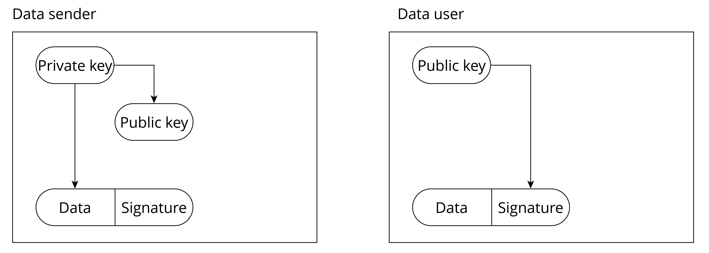

# Introduction to Digital Signature

You may have signed your name on an application for admission, legal
documents, or credit card receipts, indicating that you agree with the
content of these documents. In the field of data security, the device
needs to identify the sender or the producer of the data to indicate
that the data is not forged, has been authorised, is legitimate, and can
be used safely. Digital signature is a technical solution for verifying
data legitimacy.

Digital signature has two properties: **unforgeability**, that is, only
legitimate data senders can sign data, and other signatures are invalid;
**verifiability**, that is, data users must be able to verify the
validity of the signature.

Common digital signature algorithms include **RSA** and **DSA**. The
basic process of digital signature verification is:

1.  The data sender generates a private key, which is used to generate a
    public key, thus getting a private-public key pair. Note that only
    the private key can generate a matching public key.

2.  The data sender saves the public key to the storage system of the
    data user.

3.  The data sender signs the data with the private key and sends the
    signed data and signature to the data user.

4.  After receiving the data, the data user uses the public key stored
    in step 2 to verify the signature sent in step 3. If the
    signature is correct, the data is considered to be from a legitimate
    data sender; otherwise, the data is considered unauthorised and will
    not be used.

The basic principle of using digital signature to verify data legitimacy
is shown in Figure 13.10.

<figure align="center">
    
    <figcaption>Figure 13.10. Basic principle of using digital signatures to verify data legitimacy</figcaption>
</figure>

Through this mechanism of "private key issuing public key, private key
signing, and public key verifying signature", the legitimacy of the data
source can be authenticated. However, you may have noticed that there
are prerequisites for this scheme to be effective:

-   The private key of the data sender should not be leaked. Once the
    private key is made public, an attacker can use the public private
    key to sign illegal data and send it to the data user, then this
    verification mechanism will fail.

-   The public key of the data user cannot be removed at will. If an
    attacker generates a private-public key pair on his own system and
    replaces the public key of the data user with his own public key,
    the attacker can sign illegal data with his own private key and then
    send the illegal data to the data user. The data user may use the
    replaced public key to verify the data sent by the attacker, and
    thus consider the data to be legitimate.

In the following sections, we will see how the Secure Boot scheme is
designed to address these issues. Let's continue our journey to the next
section!
