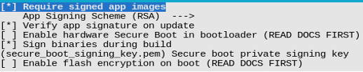
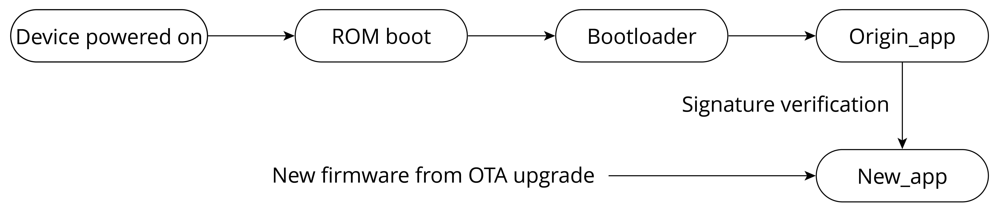
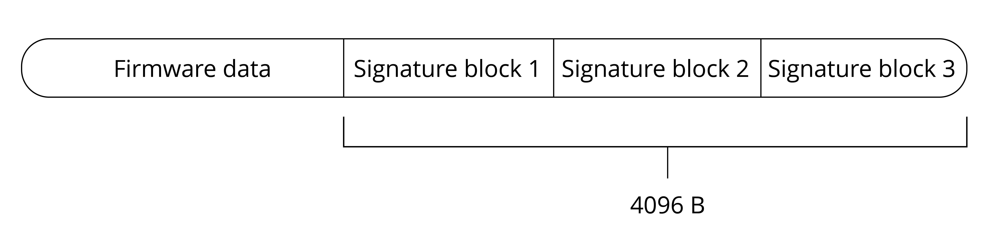

# Introduction to Software Secure Boot

Software secure boot does not need hardware support (mainly eFuse) for verification.

Before enabling software secure boot, an RSA signature private key needs to be generated using the following command:

<pre><code>$ <b>espsecure.py generate_signing_key --version 2 secure_boot_signing_key.pem</b></code></pre>

The generated private key is stored in the file `secure_boot_signing_key.pem`.

Enabling software secure boot is as simple as selecting `Require signed app images` in `menuconfig`, (as shown in Figure 13.12), followed by building and flashing the firmware.

<figure align="center">
    
    <figcaption>Figure 13.12. Enabling software secure boot for ESP32-C3</figcaption>
</figure>

When software secure boot is enabled, during firmware building, the generated app firmware (referred to as origin_app below) contains a public key, which will be used to verify the legitimacy of the new firmware `new_app` sent via OTA upgrade. As shown in Figure 13.13, during OTA upgrades, after receiving the firmware and calling `esp_ota_end()` or `esp_ota_set_boot_partition()`, software secure boot will automatically use the public key in `origin_app` to verify the digital signature attached to `new_app`.

<figure align="center">
    
    <figcaption>Figure 13.13. Software secure boot verifies new app firmware sent via OTA upgrades</figcaption>
</figure>

When software secure boot is enabled, the app firmware sent to the
device through OTA upgrade must be signed with a private key. There are
two ways to achieve this:

1.  As shown in Figure 13.12, configure the option
    `Sign binaries during build`, and specify the directory of the
    private key file, then the app firmware can be automatically signed
    when compiling.

2.  Run the following command to sign the app firmware:

    <pre><code>$ <b>espsecure.py sign_data --version 2 --keyfile PRIVATE_SIGNING_KEY BINARY_FILE</b></code></pre>

The above command directly modifies the current file and adds
verification information to it. Use the `--output` option to name the
file after the signature is added. Using a command to sign firmware
allows the signed private key to be stored on a remote server, rather
than on the build machine, therefore, it is more convenient for batch
signing on mass-produced devices.

Enabling software secure boot involves appending a signature block to
the app firmware. This signature block encompasses the necessary data
for signature verification. In the case of ESP32-C3, when utilising
software secure boot, only the initial signature block holds validity.
Conversely, when opting for hardware secure boot, up to three signature
blocks are permitted, each capable of being signed with a distinct
private key. Verification is considered successful as long as at least
one of the signatures is valid. The data format of the signed app
firmware of ESP32-C3 is shown in Figure 13.14.

<figure align="center">
    
    <figcaption>Figure 13.14. Data format of signed app firmware of ESP32-C3</figcaption>
</figure>

In the software secure boot scheme, the public key used to verify the
signature is compiled within the currently running app firmware and is
automatically managed by the device. Users are not required to manage it
manually. To obtain the content of the public key, use the following
command to manually export the public key derived from the private key:

<pre><code>$ <b>espsecure.py extract_public_key --version 2 --keyfile secure_boot_signing_key.pem pub_key.pem</b></code></pre>

In this command, `secure_boot_signing_key.pem` is the private key, and
`pub_key.pem` is the public key derived from the private key.

From the implementation principles of software secure boot, we can
conclude that the scheme verifies the `new_app` sent via OTA upgrade
using the `origin_app`. However, attackers have the potential to flash
unauthorised bootloader and `origin_app` onto the device through
physical flashing, which cannot be managed by the software secure boot.
As a result, software secure boot is more suitable for scenarios where
the device is not susceptible to physical attacks. In the subsequent
sections, we will delve into how the hardware secure boot scheme
addresses physical attacks.
