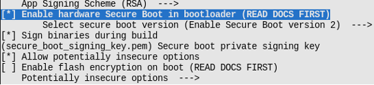
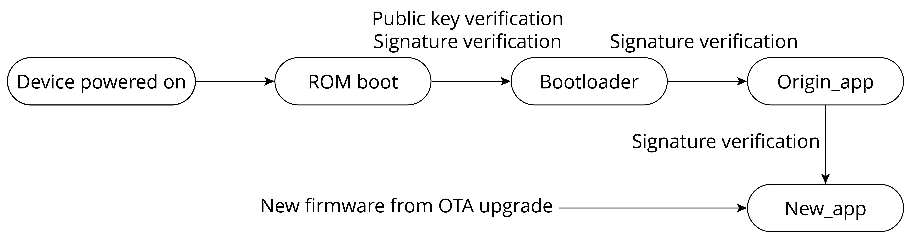

# Introduction to Hardware Secure Boot

Hardware secure boot involves verification that is done via hardware.

It uses the data stored in eFuse to verify the legitimacy of firmware
data. Relevant eFuses are shown in Table 13.3.

<i>Table 13.3. eFuses used in verifying legitimacy of firmware data</i>

|eFuses|Description|Length (bit)|
|:----:|-----------|:----------:|
|`SECURE_BOOT_EN`|If set, hardware secure boot is enabled permanently.|1|
|<code>KEY_PURPOSE_<i>X</i></code>|*X* is a natural number. For example, `KEY_PURPOSE_1` is used to set the purpose of `BLOCK_KEY1`.|4|
|`BLOCK_KEYX`|If the corresponding <code>KEY_PURPOSE_<i>X</i></code> is set to `SECURE_BOOT_DIGEST1`, then `BLOCK_KEYX` will have the SHA256 digest of the public key.|256|

Hardware secure boot supports not only all the functions of software
secure boot described in Section 13.4.3, but also additional
verifications on the bootloader and `origin_app` firmware. Hardware
secure boot scheme uses the same method of generating private-public key
pair, and the same method of signing app firmware, as presented in
Section 13.4.3.

When hardware secure boot is enabled, in addition to the app firmware,
the bootloader also requires signing, using the same method and format
as app firmware. In the event that the bootloader needs to be rebuilt
and resigned, it is necessary to execute the command `idf.py bootloader`
separately. Additionally, the command `idf.py -p PORT bootloader-flash` is required to flash the signed bootloader. Running
`idf.py flash` will only flash the signed app firmware and partition
table, excluding the bootloader.

Hardware secure boot can be enabled as follows:

1.  Open the Project Configuration Menu, navigate to
    `menuconfig → Security features` and select the `Enable hardware Secure Boot` option.

2.  If the firmware needs to be signed while compiling, specify the
    private key of the signature. As shown in Figure 13.15, specify the
    private key file through `menuconfig → Security features → Secure Boot private key`. If the private key
    has not been generated, refer to Section 13.4.3 to export the
    private key. In addition, refer to Section 13.4.3 to sign the
    firmware using `espsecure.py`.

3.  Run the command `idf.py bootloader` to build the bootloader, and
    then `idf.py -p PORT bootloader-flash` to flash the bootloader.

4.  Run `idf.py flash monitor` to flash the app firmware and partition
    table.

5.  After the device is powered on, it will execute the just-built
    bootloader, which automatically sets the `SECURE_BOOT_EN` flag in
    the eFuse, enabling permanent usage of hardware secure boot.
    Furthermore, the public key digest, which is attached to the
    signature block of the bootloader, will be written into `BLOCK_KEY`.
    Figure 13.15 shows how to enable hardware secure boot during the
    compilation stage.

<figure align="center">
    
    <figcaption>Figure 13.15. Enabling hardware secure boot during compilation</figcaption>
</figure>

> 📌 **Tip**
>
> 1.  When hardware secure boot is enabled, make sure to save the signed
>     private key file, otherwise the updated bootloader and app
>     firmware may not be sent to the device.
>
> 2.  Enabling secure boot will increase the size of bootloader, which
>     might require updating partition table offset or reducing
>     bootloader size. Refer to Section 13.3.4 for detailed
>     instructions.
>
> 3.  If more content is added to the bootloader firmware, make sure the
>     bootloader size does not exceed 0x10000.
>
> 4.  Hardware secure boot saves the SHA256 digest of the public key in
>     eFuse, not the public key itself. This is because the public key
>     itself contains a lot of data, but the eFuse space is limited.
>
> Visit <https://bookc3.espressif.com/bootloader> for more information
> about bootloader.

When hardware secure boot is enabled, the device will perform the
following verification on updated bootloader and app firmware.

1.  **Public key verification**. Upon device startup, ROM Boot will
    check the eFuse. If hardware secure boot is enabled, ROM checks the
    digest of the public key in the bootloader and validates if it
    matches the digest of the public key in eFuse. If they do not match,
    it means that the public key has been tampered with or damaged, and
    the boot is terminated; otherwise, the public key in the bootloader
    is considered correct, and the boot process continues.

2.  **Bootloader signature verification**. ROM Boot uses the public key
    to verify the bootloader signature. If the verification fails, the
    boot will be terminated; otherwise, the process continues.

3.  **`origin_app` signature verification**. The bootloader
    uses the public key to verify the signature of `origin_app`. If the
    verification fails, the boot process is terminated.

4.  **`new_app` signature verification during OTA upgrades**. This is done through `origin_app`, in a similar manner to software secure boot.

Figure 13.16 shows the basic flow of signature verification done by
hardware secure boot.

<figure align="center">
    
    <figcaption>Figure 13.16. Basic flow of signature verification by hardware secure boot</figcaption>
</figure>

> 📌 **Tip**
>
> The complete signature verification process not only verifies
> signatures, but also verifies other data, such as the digest of the
> firmware.

Hardware secure boot starts signature verification from ROM Boot, and
then progresses to the bootloader, the `origin_app` firmware, and
finally the `new_app` firmware, step by step, establishing a complete
trust chain of `ROM boot → bootloader → origin_app → new_app`. From the above-described process, it is not difficult to tell
the differences between software secure boot and hardware secure boot,
as outlined in Table 13.4.

<i>Table 13.4. Differences between software secure boot and hardware secure boot</i>

|Items|Software Secure Boot|Hardware Secure Boot|
|:---:|---|---|
|Using eFuse?|No.|Yes.|
|Scope of established trust chain|`origin_app → new_app`|A complete trust chain of `ROM boot → bootloader → origin_app → new_app`|
|
Can private key-public key pairs be replaced?
|
Yes. Re-flashing app firmware will enable a new private key-public key pair.
|
No. The public key digest is fixed in eFuse.
|
|Can be disabled?|Yes. It can be disabled by re-flashing app.bin that does not have software secure boot enabled.|No. Once hardware secure boot is enabled, the SECURE_BOOT_EN in eFuse is burnt, which means it cannot be disabled.|

The hardware secure boot scheme performs more verification during the
process from ROM Boot to `origin_app` execution, thus increasing the
device startup time and the bootloader size. In the application
scenarios where devices need to start up quickly, or small-sized
bootloader is required, software secure boot is more suitable.

When hardware secure boot is enabled, there will be some restrictions
applied to the device, including:

-   The device can only run signed bootloader and app firmware. As a
    result, re-flashed bootloader and app firmware, or updated app
    firmware via OTA upgrades need to be signed with the corresponding
    private keys.

-   In order to strengthen system security, by default, when hardware
    secure boot is enabled, JTAG debugging is disabled. Moreover, read
    protection of eFuse is disabled, and the unused signature slot in
    the eFuse is canceled. At the development stage, these functions can
    be retained through `menuconfig → Security features → Potentially insecure options`. At mass production stage, these functions should
    be disabled by default to enhance the overall security of the
    device.

-   When hardware secure boot is enabled, the device's UART download
    function will change, depending on the selected option of
    `menuconfig → security features → UART ROM download mode`. There are three options of `UART ROM download mode`, as shown in Table 13.5.

<i>Table 13.5. Options of <code>UART ROM download mode</code></i>

|Option|Description|
|:----:|-----------|
|`Enabled`|Retains flash read/write through serial port|
|
`Switch to Secure mode`
|Retains only basic functions of flash read/write through serial port. Advanced functions (such as downloading encrypted firmware) are forbidden.|
|`Permanently disabled`|Disables flash read/write through serial port|

So far, we have learnt the basic principles and common usage of hardware
secure boot. There are also advanced usages of the scheme, such as using
multiple signatures or cancelling invalid public keys.

> 📌 **Tip**
>
> Visit <https://bookc3.espressif.com/secure-boot-v2> for user guides on Secure Boot v2.
