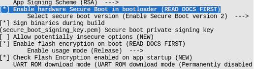

# Flash Encryption and Secure Boot

The flash encryption scheme is primarily used to safeguard the
confidentiality of data stored on the device's flash, while the secure
boot scheme is focused on ensuring the legitimacy of firmware data. For
optimal device security, it is recommended to utilise both schemes in
conjunction. As shown in Figure 13.17, flash encryption and secure boot
can be simultaneously enabled during the firmware building process.

<figure align="center">
    
    <figcaption>Figure 13.17. Enabling flash encryption and secure boot through menuconfig</figcaption>
</figure>

Additionally, when using flash encryption and secure boot, pay attention
to the following to enhance device security:

-   Generate different flash encryption keys for different devices.

-   Switch `UART ROM download mode` to `Secure mode` or `disabled mode`
    through `menuconfig → Security features`.

-   Secure the private key for signature in a private location so that
    it will not be lost or disclosed. Sign only on a secure device. If
    the key for flash encryption is exported, also save it in a private
    location.
