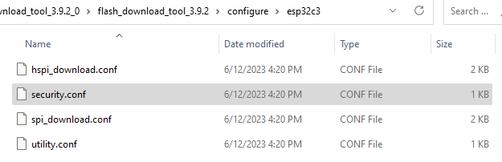

# Enabling Flash Encryption and Secure Boot with Batch Flash Tools

For Linux systems, tools such as `esptool.py` and `espsecure.py` can be
used to configure security features or flash firmware data. These tools
help leverage security features with more flexibility.

For Windows systems, the flash download tool (from
<https://www.espressif.com/zh-hans/support/download/other-tools>) can
flash firmware in batch, with both secure boot and flash encryption
enabled simultaneously. Open the `configure/esp32c3/security` file in
the tool's directory, and configure the settings of secure boot and
flash encryption. The security configuration file is shown in Figure
13.18.

<figure align="center">
    
    <figcaption>Figure 13.18. Security configuration file in flash download tool</figcaption>
</figure>

> 📌 **Tip**
>
> If the `security` file does not show when the directory is
> opened for the first time, quit the program first and re-open it, then
> the file will show.

The default security configurations in the `security` file are as follows:

```c
 [SECURE BOOT]
secure_boot_en = False      //Enable secure boot?

 [FLASH ENCRYPTION]
flash_encryption_en = False //Enable flash encryption?
reserved_burn_times = 0     //Reserve the burning times of the flash encryption control bit SPI_BOOT_CRYPT_CNT in development mode?

 [ENCRYPTION KEYS SAVE]
keys_save_enable = False    //Save the key for flash encryption locally?
encrypt_keys_enable = False //Encrypt the key saved locally?
encrypt_keys_aeskey_path =  //Key path

 [DISABLE FUNC]
jtag_disable = False
dl_encrypt_disable = False
dl_decrypt_disable = False
dl_cache_disable = False
```

Please refer to the user manual of the flash download tool for more information.

> 📌 **Tip**
>
> At production stage when both flash encryption and secure boot are
> enabled on the device, it is important to use a standard and stable
> **power supply**, otherwise the device may be damaged permanently.
