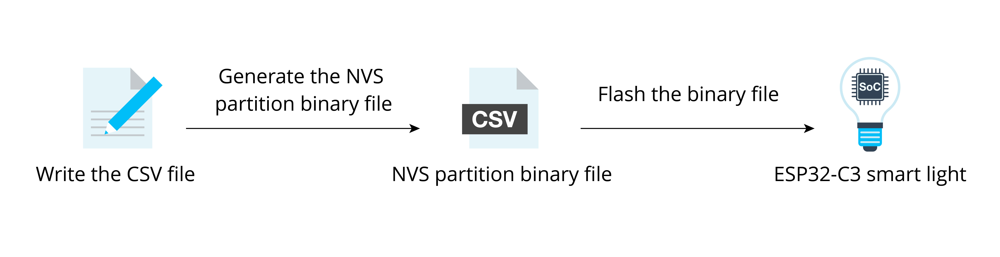

# Defining Data Partitions

To identify different smart products on the market and bind them to
their users, it is often necessary to store some unique data in each
smart product. For example, in order for smart products to effectively
connect to the vendor's cloud platform, unique authentication
information (e.g., device certificate, ID, and password) should be
generated and stored in each smart product. It will be used on the
server side when the smart product is connected and authenticated.

During the development stage, we can easily store the authentication
information in a smart product, by defining constants and storing them
in firmware, or by writing it into Flash. But in mass production, these
methods become clumsy and inefficient. Therefore, a more convenient
method is needed to burn data partitions in actual production.

In *Part II Hardware and Driver Development*, Section 6.4.1, we
introduced the NVS library, which can be an option to store the unique
mass production data of smart products, as well as any
application-related user data. User data are often read and modified
when using a smart production, and will be erased when reset to factory,
while the unique mass production data can only be read. Therefore, mass
production data and user data need to be assigned different namespaces,
for example `mass_prod` (for production data) and `user_data` (for user data). This makes it possible to directly erase the user data while keeping the mass production data unaffected during a factory reset. Besides, the mass production data and user data can also be stored separately in different NVS partitions.

The following code shows how to store product certificate under `mass_prod` and the SSID of Wi-Fi under `user_data`:

```c
nvs_handle_t mass_prod_handle = NULL;
nvs_handle_t user_data_handle = NULL;
//Initialize NVS Flash Storage
nvs_flash_init_partition(partition_label);

//Open non-volatile storage with mass_prod namespace
nvs_open("mass_prod", NVS_READONLY, &mass_prod_handle);

//Open non-volatile storage with user_data namespace
nvs_open("user_data", NVS_READWRITE, &user_data_handle);

uint8_t *product_cert = malloc(2048);
//read operation in mass_prod namespace
nvs_get_blob(mass_prod_handle, "product_cert", &product_cert);

char ssid[36] = {0};
//read operation in user_data namespace
nvs_get_str(user_data_handle, "ssid", &ssid);
//write operation in user_data namespace
nvs_set_str(user_data_handle, "ssid", &ssid);

//Erase user_date namespace when reset to factory
nvs_erase_all(user_data_handle);
```

Now that we've known how to store mass production data, we need to
convert them into a required format before flashing them onto the
device. The basic steps for generating mass production data are shown in
Figure 14.1.

<figure align="center">
    
    <figcaption>Figure 14.1. Basic steps for generating mass production data</figcaption>
</figure>

First, create a CSV file to store key-value pairs; write the data needed
into the file. For mass production, an NVS partition binary file should
be generated from this CSV file, then be burned to the device. For each
device produced, a unique NVS partition binary file will be burned to
it. For example:

```
key,          type,     encoding, value
mass_prod,    namespace,,
ProductID,    data,     string,   12345
DeviceSecret, data,     string,   12345678901234567890123456789012
DeviceName,   data,     string,   123456789012
```

Second, use `esp-idf/components/nvs_flash/nvs_partition_generator/nvs_partition_gen.py` to generate the NVS partition binary file on the development host with the following command:

<pre><code>$ <b>python $IDF_PATH/components/nvs_flash/nvs_partition_generator/nvs_partition_gen.py --input mass_prod.csv --output mass_prod.bin --size NVS_PARTITION_SIZE</b></code></pre>

> 📌 **Tip**
>
> Replace the `NVS_PARTITION_SIZE` parameter with the actual
> size of the corresponding NVS partition in the partition table. After
> executing the above command, the resulting file `mass_prod.bin` is the binary file for mass production. Run the following command to burn this file to the device Flash.

<pre><code>$ <b>python $IDF_PATH/components/esptool_py/esptool/esptool.py --port $ESPPORT write_flash NVS_PARTITION_ADDRESS mass_prod.bin</b></code></pre>

> 📌 **Tip**
>
> Replace the `NVS_PARTITION_ADDRESS` parameter with the
> actual address of the corresponding NVS partition in the partition
> table.
