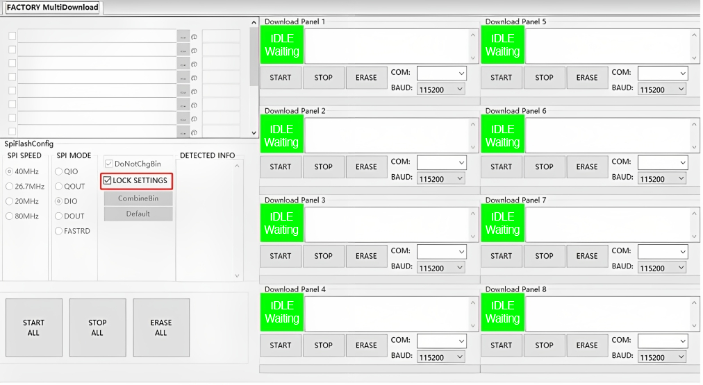

# Firmware Burning

In mass production, the binary files that need to be burned to the
device include:

-   firmware for mass production devices
-   binary files of mass production data

During the burning, it is necessary to ensure that a unique binary file
of mass production data is burned to each device, while the application
firmware is usually the same for all devices. To achieve this, we can
write a script to generate a unique binary file of mass production data
for each device based on its MAC address. Then, this file can be burned
to the device together with the application firmware. In this process, a
table that relates the MAC address of each device to its mass production
data can also be created for querying, debugging, and tracking.

Espressif can customize firmware for our module products based on
customers' requirements. For example, we can conduct safety
configurations to ESP32-C3 series of modules, including the unique mass
production data for each device. In this way, Espressif modules can be
mounted directly onto the product's hardware circuit, which saves
manufacturers' trouble for secondary burning. Espressif also provides a
Flash Download Tool, where a factory mode can be used to burn multiple
devices at a time. For more details about the Flash Download Tool,
please check the documentation on our website.

<figure align="center">
    
    <figcaption>Figure 14.2. Interface of factory mode in Flash Download Tool</figcaption>
</figure>

The interface of factory mode in the Flash Download Tool is shown in
Figure 14.2. In factory mode, Flash Download Tool loads firmware through
relative paths and by default burns the firmware stored in bin directory
to device. Users may store their firmware in the bin folder under the
tool directory so that they can copy the project to different computers
without triggering path-related errors.
