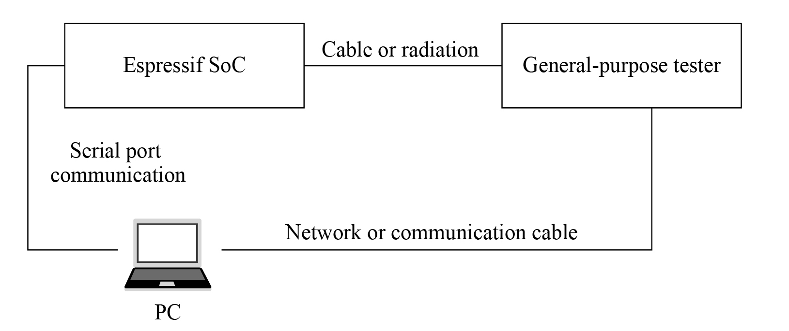
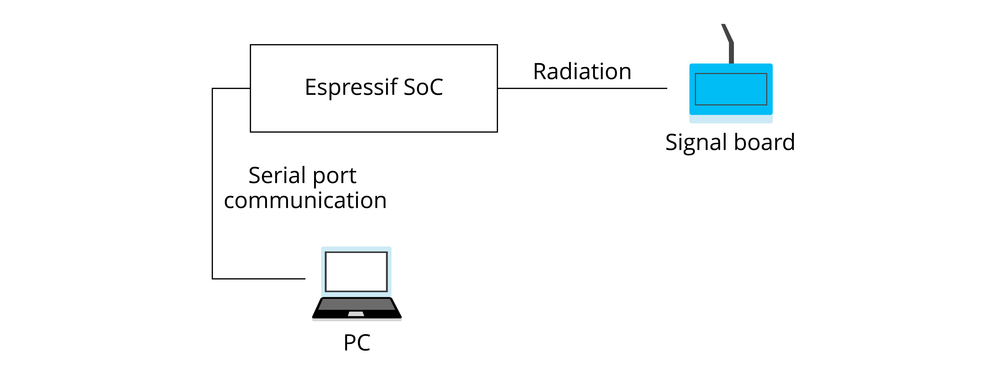

# Mass Production Testing

The purpose of mass production testing is to ensure that the functions
and performance of the whole product meet standards, so it is necessary
to fully check the functions and performance of each product during this
stage. Depending on the product characteristics, the schemes for mass
production testing can be slightly different. For RF communication
products, it is necessary to ensure that RF performance meets standards
and each component functions as expected. This normally involves RF
performance test, power consumption test, and functional test of various
peripherals.

For wireless products, common mass production testing includes
electromagnetic compatibility (EMC) test, RF performance test,
production compliance test, safety test, SAR (Specific Absorption Rate)
test, etc., among which the RF performance test is of high importance,
thus requiring a large amount of testing. It is conducted to verify
whether the RF performance of a product meets the designated
requirements and relevant standards. It involves two sets of indicators:
Transmitter (TX) and Receiver (RX) characteristics.

This section mainly introduces the mass production testing schemes for
products with Espressif Wi-Fi / Bluetooth Low Energy (BLE) modules and
chips, which can be used as a reference for designing testing schemes
for similar products. For detailed information, please refer to
Espressif Production Testing Guide on our official website. Generally,
there are two production testing schemes available for RF performance
test: **RF General-purpose Tester Scheme** (widely adopted in the
industry) and **Signal Board Scheme** (designed by Espressif).

## RF General-purpose Tester Scheme

The tester scheme is widely used for the production testing of Wi-Fi /
BLE products. Espressif provides the necessary serial port commands and
firmware, so the customers can easily use this scheme for testing. The
testing steps are demonstrated in Figure 14.3.

<figure align="center">
    
    <figcaption>Figure 14.3. Diagram of the tester scheme</figcaption>
</figure>

## Signal Board Scheme

The signal board scheme is specially designed by Espressif, which can
effectively test the RF performance of the mass-produced Wi-Fi / BLE
products, thus guaranteeing the RF quality. This scheme features low
cost of hardware and easy environment setup for factories.

As demonstrated in Figure 14.4, the signal board can be used as a
standard device to communicate with the DUT (Device Under Test) and test
it by analyzing the communication data. Hardware connection for signal
board scheme is demonstrated in Figure 14.5.

<figure align="center">

<figcaption>Figure 14.4. Diagram of signal board scheme</figcaption>
  

<figcaption>Figure 14.5. Hardware connection for signal board scheme</figcaption>
</figure>
