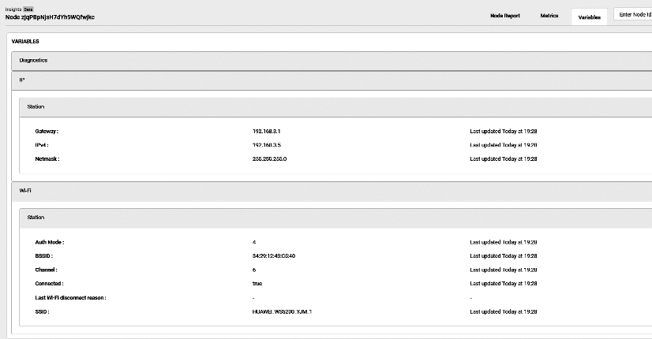

# Introduction to ESP Insights

ESP Insights (project link: <https://github.com/espressif/esp-insights>)
is a remote monitoring platform that allows users to monitor the health
of the device remotely, including warning and error logs, metrics for
device operating parameters, device coredump information, and custom
data and events.

In this chapter, we will introduce the functions and applications of ESP
Insights based on the `esp-insights` project. The commit ID is
`afd70855eb4f456e7ef7dc233bf082ec7892d9df`.

ESP Insights includes a firmware agent, the Insights agent, that
captures vital pieces of diagnostics information from the device during
runtime and uploads them to the ESP Insights cloud. The cloud then
processes this data for visualization. Developers can log in to a
web-based dashboard to look at the health and issues reported by their
devices in the field. Currently, we only support processing diagnostics
information and reports on the ESP RainMaker IoT cloud platform. Support
for other cloud platforms will be available in later releases. Figure
15.1 presents the ESP RainMaker IoT cloud platform overview report.
Figure 15.2 presents the ESP RainMaker IoT cloud platform metrics
report. Figure 15.3 presents the ESP RainMaker IoT cloud platform
variables report.

<figure align="center">
    
    <figcaption>Figure 15.1. Overview report by ESP RainMaker</figcaption>
      
    
    <figcaption>Figure 15.2. Metrics report by ESP RainMaker</figcaption>
      
    
    <figcaption>Figure 15.3. Variable report by ESP RainMaker</figcaption>
</figure>

Currently, developers can monitor the following information on the
web-based dashboard:

- **Error logs**: Outputs by the serial port when the log printing function `ESP_LOGE()` is called by components or user applications.

- **Warning logs**: Outputs by the serial port when the log printing function `ESP_LOGW()` is called by components or user applications.

- **Custom events**: Outputs by the serial port when `ESP_DIAG_EVENT()` is called by user applications. Custom events can be used for user-defined data.

- **Reset reason**: Reasons why the device is reset, e.g., powered on, software reset, brownout, etc.

- **Coredump summary**: Register contents and stack backtrace of the offending thread in case of a crash.

- **Metrics**: Time-varying data, e.g., the free heap size, the Wi-Fi signal strength plotted over time, etc.

- **Variables**: Variable values, e.g., the device's IP address, gateway address, Wi-Fi connection information, etc.

## Features of ESP Insights

- Check device properties (e.g., name, ID, firmware version, etc.) and device status (e.g., memory usage, maximum free block, free heap value, Wi-Fi signal strength, etc.).

- Check logs generated during device firmware operation, such as error and warning logs, crash backtrace information, reboots, and other custom events.

- Check the current data reported by the device and generate data sheets according to time.

- Support customised metrics and variables based on users' needs.

## Advantages of ESP Insights

-   Accelerate the development and release of software products.

    Beta tests are normally required before releasing any software
    products officially. During the beta testing, users will provide
    feedback regarding the performance, stability, reliability, and
    other problems of the product in real usage scenarios, which will
    then be handled and fixed by developers. This process often costs
    developers a large amount of time and effort in locating problems
    and analysing the causes. With ESP Insights, developers can check
    the device operation status remotely and obtain the details of
    abnormal events in a timely manner, saving the time on handling
    problems greatly and accelerating the software development and
    release process. ESP Insights also saves the records of abnormal
    events occured before the device firmware crashes. After the device
    is rebooted, it uploads the data to the cloud, thus avoiding losing
    abnormal information.

-   Handle various firmware problems in a timely manner. For example:

    -   Developers can use ESP Insights to check device status (such as
        available memory space, maximum free block, Wi-Fi signal
        strength, etc.), analyse the peak value of each metric of the
        device, and introduce optimisation in future firmware versions.

    -   The logs of ESP Insights record the details of all abnormal
        events, so that developers can handle the abnormality in time
        before it is detected by the user, preventing any impact of
        device abnormality on the actual use of the device.

-   Data transmission: lightweight, simple, safe, and reliable.

    ESP Insights is capable of transmitting diagnostics data using the
    HTTPS protocol and the MQTT protocol. When working with the ESP
    RainMaker IoT cloud platform, ESP Insights supports sharing the
    diagnostics data transmitted over an encrypted channel via the MQTT
    protocol with the RainMaker IoT Cloud Platform, greatly reducing the
    memory usage of the device while ensuring the information security.
    If you are not using the ESP RainMaker IoT cloud platform, you can
    use the HTTPS protocol alone to transfer the diagnostics data.
    However, compared with the ESP RainMaker IoT cloud platform, using
    the HTTPS protocol alone requires adding a TLS link, which will lead
    to increased memory usage. The data transmitted between the device
    and the cloud platform is optimised by the CBOR encoding, which
    significantly saves data transmission bandwidth. In the future, ESP
    Insights will also integrate device data with the command and
    control data from the cloud, and pack them into the same MQTT
    message, further reducing costs with fewer MQTT messages.
