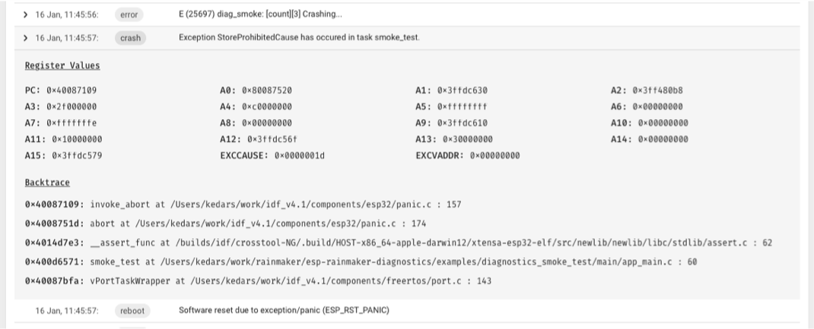

# Reporting Coredump Information

In case of a firmware crash, the Insights agent captures the coredump
information into the flash memory and reports it to the ESP Insights
cloud in the subsequent boot-up. This allows you to look at all the
crash logs that the devices may be generating in the field.

The entire stack backtrace leading up to the crash is also captured and
reported. To optimise the device-cloud communication, the firmware only
sends a summary of the coredump. The summary contains the most useful
contents of the coredump like program counter, exception cause,
exception address, general purpose registers, and the backtrace. Figure
15.4 shows a piece of coredump information.

<figure align="center">
    
    <figcaption>Figure 15.4. Coredump information</figcaption>
</figure>

This feature requires the following configurations, which should be added to the project's default configuration file `sdkconfig.defaults`.

```c
CONFIG_ESP32_ENABLE_COREDUMP=y
CONFIG_ESP32_ENABLE_COREDUMP_TO_FLASH=y
CONFIG_ESP32_COREDUMP_DATA_FORMAT_ELF=y
CONFIG_ESP32_COREDUMP_CHECKSUM_CRC32=y
CONFIG_ESP32_CORE_DUMP_MAX_TASKS_NUM=64
```

To store the coredump into flash, an additional coredump partition is required. Add the following line to the `partitions.csv` of the project.

```csv
coredump, data, coredump, , 64K
```
