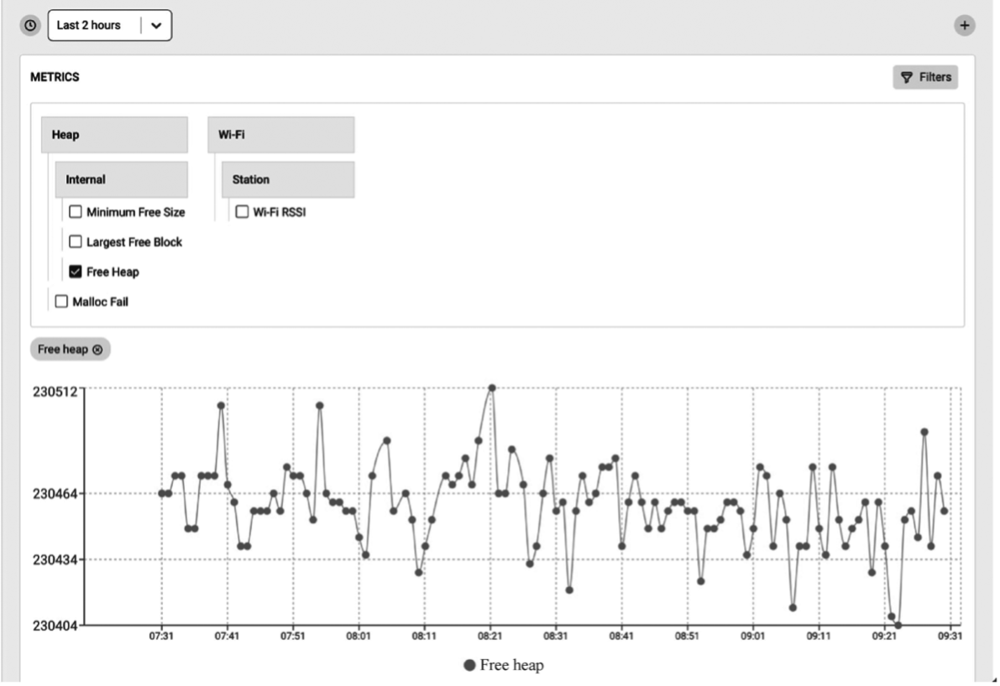

# Reporting Custom Metrics

The Insights agent supports recording and reporting metrics to the cloud. You may then view graphs through the Insights dashboard, which plot the changes of these metrics over a period of time.

Set `CONFIG_DIAG_ENABLE_METRICS=y` to enable metrics support. The Insights agent can record a set of pre-defined system metrics such as memory and Wi-Fi signal strength. Additionally, you could add your own custom metrics. Figure 15.5 represents some metrics information.

<figure align="center">
    
    <figcaption>Figure 15.5. Metrics information</figcaption>
</figure>

## Heap metrics

The Insights agent supports reporting free memory, largest free block,
and minimum free memory ever. These parameters are tracked and reported
for heap in the internal RAM as well as for the heap in the external RAM
(in case the device has the PSRAM). The Insights agent also records
failed memory allocations, which is available from ESP-IDF v4.2 and
onwards.

Set `CONFIG_DIAG_ENABLE_HEAP_METRICS=y` to enable heap metrics.

## Wi-Fi metrics

The ESP Insights agent also supports Wi-Fi metrics. It collects Wi-Fi
signal strength (RSSI), and minimum RSSI information. RSSI is sampled
every 30 seconds and if there is a 5 dB difference between the previous
count and the current count, it will be reported to the ESP Insights
cloud. From ESP-IDF v4.3 onwards, minimum RSSI is also recorded when the
RSSI value drops below a pre-configured threshold. The threshold can be
configured by calling `esp_wifi_set_rssi_threshold()`. There is also a
function which can collect and report Wi-Fi metrics at any given time:

```c
/*Reports RSSI to cloud and also prints to console*/
esp_diag_wifi_metrics_dump();
```

## Custom metrics

Developers can add custom metrics through the following functions.

```c
/*Register a metrics to track room temperature*/
esp_diag_metrics_register("temp", "temp1", "Room temperature", "room", ESP_DIAG_DATA_TYPE_UINT);

/*Record a data point for room temperature*/
uint32_t room_temp = get_room_temperature();
esp_diag_metrics_add_uint("temp1", &room_temp);
```

The prototype of the `esp_diag_metrics_register()` function is as follows:

```c
esp_err_t esp_diag_metrics_register(const char *tag, const char *key,
                                    const char *label, const char *path, 
                                    esp_diag_data_type_t type);
```

In the prototype of the function `esp_diag_metrics_register()`, the
parameter `tag` indicates the label of the metrics, which can be defined
by the users. The parameter `key` indicates the unique identifier of the
metrics, which is used to find and set the identifier of the metrics.
The parameter `label` is the label displayed in the ESP Insights
dashboard. The parameter `path` indicates a hierarchical path to the
`key`, which must be divided by ".", e.g `wifi`, `heap.internal`, and
`heap.external`. The parameter `type` represents the data type, which
supports the following enumeration values:

```c
typedef enum {
    ESP_DIAG_DATA_TYPE_BOOL,     /*! < Data type boolean*/
    ESP_DIAG_DATA_TYPE_BOOL,     /*! < Data type boolean*/
    ESP_DIAG_DATA_TYPE_UINT,     /*! < Data type unsigned integer*/
    ESP_DIAG_DATA_TYPE_FLOAT,    /*! < Data type float*/
    ESP_DIAG_DATA_TYPE_STR,      /*! < Data type string*/
    ESP_DIAG_DATA_TYPE_IPv4,     /*! < Data type IPv4 address*/
    ESP_DIAG_DATA_TYPE_MAC,      /*! < Data type MAC address*/
} esp_diag_data_type_t;
```

## Variables

Variables are similar to metrics, but do not need tracing over time
since they generally represent information of devices, for example, the
IP address of the device. You may set `CONFIG_DIAG_ENABLE_VARIABLES=y`
to enable variables support. Like metrics, a set of pre-defined
variables are supported, such as IP and Wi-Fi. Additionally, you may add
your own custom variables. The variable information is shown in Figure
15.6.

<figure align="center">
    
    <figcaption>Figure 15.6. Variable information</figcaption>
</figure>

-   **Network variables**

    As shown in Figure 15.6, ESP Insights currently supports variables in Wi-Fi and IP. For Wi-Fi, supported variables include BSSID, SSID, Wi-Fi disconnection reason, current channel, Wi-Fi connection authentication mode, and connection status. For IP, supported variables include gateway address, IPv4 address, and netmask parameters.

-   **Custom Variables**

    Developers can add custom variables through the following functions:

    ```c
    /*Register a variable to track stations associated with ESP32 AP*/
    esp_diag_variable_register("wifi", "sta_cnt", "STAs associated", "wifi.sta", ESP_DIAG_DATA_TYPE_UINT);

    /*Assuming WIFI_EVENT_AP_STACONNECTED and WIFI_EVENT_AP_STADISCONNECTED events track the number of associated stations*/
    esp_diag_variable_add_uint("sta_cnt", &sta_cnt);
    ```

    The prototype of the `esp_diag_metrics_register()` function is as follows:

    ```c
    esp_err_t esp_diag_variable_register(const char *tag, const char *key, const char *label, 
                                        const char *path, esp_diag_data_type_t type);
    ```

    The parameters of the function `esp_diag_variable_register()` share the same meanings as those of the function `esp_diag_metrics_register()`.
