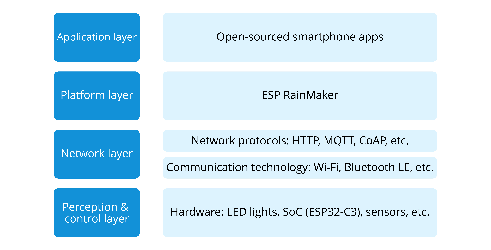

# Project Structure

The Smart Light project consists of three parts:

- **Smart light devices based on ESP32-C3**, responsible for interacting with IoT cloud platforms, and controlling the switch, brightness and color temperature of the LED lamp beads.

- **Smartphone apps** (including tablet apps running on Android and iOS), responsible for network configuration of smart light products, as well as querying and controlling their status.

- **An IoT cloud platform based on ESP RainMaker**. For simplification, we consider the IoT cloud platform and business server as a whole in this book. Details about ESP RainMaker will be provided in Chapter 3.

The correspondence between the Smart Light project structure and the architecture of IoT is shown in Figure 2.1.

<figure align="center">
    
    <figcaption>Figure 2.1. Structure of smart light project</figcaption>
</figure>
